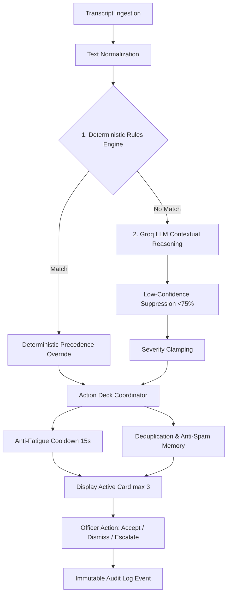

# Mortgage AI Copilot

Darwix AI is an enterprise-grade real-time compliance copilot and workflow automation platform purpose-built for U.S. residential mortgage origination. It pairs deterministic regulatory verification executing in sub-20ms with low-latency Large Language Model reasoning (Groq LLaMA 3.3 70B) to protect lenders from severe statutory violations, eliminate post-call administrative drag, and streamline Fannie Mae Form 1003 origination.

---

## Overview

In the U.S. mortgage industry, Loan Officers (MLOs) operate in a high-stakes, highly regulated environment. Every borrower conversation touches strict federal consumer protection statutes (CFPB TRID, Dodd-Frank ATR/QM, TILA Regulation Z, 18 U.S.C. § 1014). An inadvertent verbal pre-approval promise or quoting an interest rate without disclosing the Annual Percentage Rate (APR) exposes lending institutions to civil money penalties, mandatory borrower restitution, or costly loan buybacks.

Darwix AI functions as an invisible in-call cockpit and post-call automation copilot:
- **During the Call**: Runs real-time multi-speaker diarization, flags compliance infractions within milliseconds, suggests compliant phrasing, and extracts structured Form 1003 financial facts.
- **After the Call**: Synthesizes verified borrower profiles, segregates stated from verified income, and syncs data to Salesforce CRM and ICE Encompass LOS with mandatory human approval gates.

---

## Problem

1. **High In-Call Cognitive Overload**: Loan officers must balance relationship building, active listening, debt-to-income (DTI) calculations, and probing for unstated liabilities while navigating multiple legacy screens.
2. **Regulatory Exposure**: Verbal representations made during consultations can easily violate federal laws:
   - *TRID 12 CFR § 1026.19*: Verbal promises ("You should be approved") before underwriter review and formal Loan Estimate (LE) issuance.
   - *TILA 12 CFR § 1026.24*: Mentioning interest rates without stating the APR.
   - *18 U.S.C. § 1014*: Encouraging borrowers to omit existing recurring debts from credit applications.
3. **Data Pollution (Stated vs. Verified)**: Verbal borrower claims (e.g., cash gig income or unverified self-employment) are often improperly treated as qualifying income, causing severe delays or loan rejections during underwriting.
4. **Administrative Fatigue**: Loan officers spend 30–45 minutes after each consultation manually re-keying notes into CRMs, drafting Form 1003s in the LOS, and manually compiling document request checklists.

---

## Product Vision

To empower mortgage lenders with an **advisory-first, compliance-driven AI Copilot** that:
- Elevates Loan Officer performance without replacing human relationship building.
- Enforces 100% predictable, zero-hallucination regulatory guardrails via deterministic rule precedence.
- Automates 85% of post-meeting administrative tasks through idempotent enterprise integrations.
- Maintains strict human-in-the-loop governance: the copilot advises, prepares, and structures, but certified licensed officers authorize every external action.

---

## Key User Journey

The product implements a seamless 6-phase mortgage lifecycle:

```
[1. Prepare]   -->   [2. Meet]   -->   [3. Copilot]   -->   [4. Summary]   -->   [5. Execute]   -->   [6. Monitor]
 Pre-Meeting           Live Audio         Real-Time          Post-Meeting        Enterprise Sync     Manager & Ops
 Intelligence        Transcription      Interventions       Human Review         CRM / LOS / Docs     Dashboards
```

1. **Prepare (Pre-Meeting)**: Synthesizes CRM/LOS records into an instant briefing, highlighting credit tier, initial DTI, and missing documents before the call begins.
2. **Meet (Live Workspace)**: Dual-channel audio wave simulation and real-time streaming transcript for borrower and officer.
3. **Copilot (In-Call Guidance)**: Dual-engine intervention cards appear with suggested talking points, compliance alerts, and Form 1003 fact extraction.
4. **Summary (Post-Call Review)**: AI-synthesized executive wrap-up, underwriting risk matrix, and stated vs. verified financial segregation.
5. **Execute (Enterprise Sync)**: One-click gated sync to Salesforce Financial Services Cloud, ICE Encompass, and borrower document vaults.
6. **Monitor (Governance)**: Branch managers track team compliance scores; operations specialists resolve document blockers and data conflicts.

---

## AI Copilot

The in-call copilot HUD provides non-intrusive, context-aware assistance:
- **Live Fact Ledger**: Extracts loan amounts, purchase prices, loan programs, and down payments as they are spoken.
- **Suggested Responses**: Compliant answers for complex borrower questions (e.g., down payment requirements, rate volatility).
- **Voice Assistance**: One-click audio playback of suggested phrasing via ElevenLabs text-to-speech.
- **Explainability**: Every suggestion displays confidence ratings, source transcript citations, and underlying regulatory authority.

---

## Intervention Engine

The copilot utilizes a **15-stage dual-engine intervention pipeline**:



### Deterministic Priority 1 Rules
- Runs synchronously in `<20ms` using strict regex and keyword patterns.
- Evaluates statutory boundaries: TRID, TILA, ATR/QM, Liability Omission, and UDAAP.
- **Absolute Precedence**: Overrides any contradictory LLM recommendation.

### Contextual Priority 2 LLM (Groq LLaMA 3.3 70B)
- Evaluates consultative nuance, objection handling, and complex multi-turn context.
- Fallback to pre-compiled heuristic templates if API latency exceeds 1,500ms or fails.

### Nudge Fatigue Controls
- **Rate Limiting**: Enforces a 15-second cooldown between non-critical suggestions.
- **Deck Clamping**: Caps visible floating cards to a maximum of 3.
- **Anti-Spam Memory**: Suppresses previously dismissed advisory categories for the remainder of the session.

---

## Enterprise Workflow

Darwix AI bridges front-line calls with back-office core systems:

- **Salesforce Financial Services Cloud (CRM)**:
  - Updates Lead status to `Pre-Qualified`.
  - Automatically logs timestamped consultation notes (`CRM-ACT-20891`).
  - Schedules prioritized follow-up tasks for the loan officer.
- **ICE Encompass (LOS)**:
  - Generates valid MISMO 3.4 Form 1003 loan application drafts (`ENC-1003-99412`).
  - Sets file stage to `Documentation Pending`.
  - Enforces underwriting boundaries: blocks automated credit approval decisions.
- **Document Vault (Blend / Roostify)**:
  - Generates custom borrower upload checklists (`DOC-REQ-88201`).
  - Flags missing W-2s, 1040s, Schedule C, and bank statements.
- **Mandatory Human-in-the-Loop Gate**:
  - No external sync occurs automatically.
  - The Loan Officer must explicitly review, adjust if necessary, and sign off.

---

## User Roles

| Role | Primary Route | Description & Permissions |
| :--- | :--- | :--- |
| **Loan Officer** | `/dashboard`, `/meetings/[id]/live`, `/meetings/[id]/summary` | Conducts consultations, views live copilot HUD, reviews post-meeting summaries, and approves CRM/LOS syncs. |
| **Branch Manager** | `/manager` | Monitors branch-wide compliance score (94.2%), escalation queues, team coaching needs, and loan officer adoption metrics. |
| **Operations Specialist** | `/operations` | Triages incoming loan files, reviews stated vs. verified discrepancies, and tracks document SLA fulfillment. |
| **Borrower (Customer)** | `/customer/[id]` | Transparent borrower portal showing loan progress milestones, required document checklists, and contact info (internal risk flags strictly excluded). |
| **Evaluator / Auditor** | `/demo` | Guided demo hub with 6-phase journey ribbon, scenario triggers, and one-click demo reset. |

---

## Integrations

All enterprise integration adapters follow strict TypeScript interfaces (`lib/integrations/types.ts`):

- **CRM Adapter** (`lib/integrations/crm/`): Salesforce Financial Services Cloud.
- **LOS Adapter** (`lib/integrations/los/`): ICE Encompass (MISMO 3.4 XML/JSON).
- **Document Adapter** (`lib/integrations/documents/`): Blend / Roostify digital mortgage vault.
- **Communication Adapter** (`lib/integrations/communications/`): SendGrid / SMS borrower notification service.

*All adapters enforce idempotent executions using deterministic payload hashes to prevent duplicate file creation upon network retries.*

---

## Compliance & Safety

The copilot embeds federal mortgage compliance directly into the software architecture:

1. **TRID Informal Pre-Approval (12 CFR § 1026.19)**: Prevents premature verbal loan commitments.
2. **TILA APR Oral Disclosures (12 CFR § 1026.24)**: Prohibits quoting interest rates without disclosing corresponding APR and terms.
3. **Mortgage Fraud / Liability Omission (18 U.S.C. § 1014)**: Flags suggestions to omit debts as `CRITICAL` compliance infractions.
4. **Dodd-Frank Ability-to-Repay (ATR / 12 CFR § 1026.43)**: Segregates undocumented cash income from qualifying income calculations.
5. **FTC Act Section 5 / UDAAP**: Intercepts unsubstantiated competitor rate-match guarantees.
6. **Equal Credit Opportunity Act (ECOA / 12 CFR § 1002.5)**: Prohibits inappropriate inquiries regarding family planning or marital status outside Form 1003 parameters.
7. **Ephemeral Voice Processing (GLBA)**: Zero persistent storage of raw call audio. Audio is processed in memory and discarded; only encrypted transcripts and audit logs persist.

---

## Voice Assistance

- **Powered by ElevenLabs**: Provides realistic, low-latency text-to-speech audio coaching.
- **Server-Side Security**: Audio requests route securely through `/api/voice/speak`. API keys are strictly hidden from client bundles.
- **Selective Playback**: Restricted to consultative objection handling and suggested talking points. Critical compliance warnings remain visual to avoid interrupting speech.
- **Graceful Degradation**: If the voice service is unconfigured or unavailable, the UI seamlessly defaults to text-only mode with zero errors.

---

## Demo

Experience the full end-to-end product demonstration at `/demo`:

### 4 Recommended Demonstration Scenarios
1. **Unverifiable Cash Income**: Borrower mentions $8,000 cash consulting income. Copilot enforces ATR rule and isolates stated from verified income.
2. **Conflicting Borrower Debt**: Co-borrowers disagree on auto loan payment ($500 vs $1,200). Copilot flags conflict and requests official statement.
3. **Informal Approval Prevention**: Officer casually states "You should be approved." Copilot fires immediate TRID compliance warning.
4. **Liability Omission Prevention**: Officer suggests omitting car loan. Copilot blocks action as a CRITICAL 18 U.S.C. § 1014 violation.

### Demo Controls
- **Restart Demo**: Clears all local storage, approvals, and sync states via `POST /api/demo/reset`.
- **Skip to Summary**: Jumps directly to post-meeting review with pre-populated transcript data.

---

## Architecture

```
                                +-------------------------------------------+
                                |          Next.js 16 App Router            |
                                |  (/demo, /meetings, /manager, /operations) |
                                +---------------------+---------------------+
                                                      |
                                                      v
                                +-------------------------------------------+
                                |        Meeting Coordination Layer         |
                                |  (Simulated Stream, Fact Ledger, Audio)   |
                                +---------------------+---------------------+
                                                      |
                         +----------------------------+----------------------------+
                         |                                                         |
                         v                                                         v
          +------------------------------+                          +------------------------------+
          |  Deterministic Rule Engine   |                          |   Contextual AI LLM Engine   |
          |  - TRID / TILA / 18 USC 1014 |                          |   - Groq LLaMA 3.3 70B       |
          |  - Latency: <20ms            |                          |   - Nuance & Objections      |
          |  - Absolute Priority         |                          |   - Fallback on Timeout      |
          +--------------+---------------+                          +--------------+---------------+
                         |                                                         |
                         +----------------------------+----------------------------+
                                                      |
                                                      v
                                +-------------------------------------------+
                                |      Intervention Coordinator / Guard     |
                                |  (Anti-Fatigue Cooldown, Severity Rank)   |
                                +---------------------+---------------------+
                                                      |
                         +----------------------------+----------------------------+
                         |                                                         |
                         v                                                         v
          +------------------------------+                          +------------------------------+
          |  Human-in-the-Loop Review    |                          |  Tamper-Evident Audit Log    |
          |  - Approve / Edit / Reject   |                          |  - SHA-256 State Hash        |
          +--------------+---------------+                          +------------------------------+
                         |
                         v
          +---------------------------------------------------------+
          |         Enterprise Integration Layer (Adapters)         |
          |    Salesforce CRM  |  ICE Encompass LOS  |  Blend Docs  |
          +---------------------------------------------------------+
```

---

## Tech Stack

- **Framework**: Next.js 16 (App Router, Turbopack, React 19)
- **Language**: TypeScript 5 (Strict mode)
- **Styling**: Tailwind CSS v4 (Full dark/light mode support)
- **AI / LLM**: Groq Cloud SDK (`llama-3.3-70b-versatile`)
- **Voice / Audio**: ElevenLabs Text-to-Speech API
- **Testing**: Vitest with `@testing-library/react` and jsdom
- **Icons**: Lucide React

---

## Local Setup

### Prerequisites
- Node.js 18.17+ or 20+
- npm 9+

### Installation
```bash
# Clone the repository
git clone https://github.com/Roushan0012/mortgage-ai-copilot.git
cd mortgage-ai-copilot

# Install dependencies
npm install

# Start development server
npm run dev
```

Open [http://localhost:3000](http://localhost:3000) (or navigate directly to [http://localhost:3000/demo](http://localhost:3000/demo)).

---

## Environment Variables

The application runs fully functional out of the box in offline/mock mode. To enable live Groq AI inference and ElevenLabs voice generation, copy `.env.example` to `.env`:

```bash
# Groq Cloud API Key (for live LPU contextual reasoning)
GROQ_API_KEY=gsk_your_groq_api_key_here

# ElevenLabs API Key (for realistic AI voice audio)
ELEVENLABS_API_KEY=xi_your_elevenlabs_api_key_here
ELEVENLABS_VOICE_ID=21m00Tcm4TlvDq8ikWAM
ELEVENLABS_MODEL_ID=eleven_monolingual_v1
```

> **Security Rule**: API keys are server-side only. Never prefix secret variables with `NEXT_PUBLIC_`. The `.gitignore` file strictly blocks `.env` and `.env.local`.

---

## Testing

The project includes 44 automated unit and integration tests across 5 test suites:

```bash
# Run test suite
npm test

# Run code linter
npm run lint

# Run TypeScript typecheck
npm run typecheck

# Production build verification
npm run build
```

### Test Suites
- `tests/assessment-hardening.test.ts`: Validates 14 required intervention scenarios, high-risk compliance triggers, and demo reset idempotency.
- `tests/integrations.test.ts`: Tests CRM/LOS adapters, stated vs. verified isolation, and human approval gates.
- `tests/intervention-engine.test.ts`: Verifies deterministic rule matching, regex performance, and override mechanics.
- `tests/pipeline-guardrails.test.ts`: Tests anti-spam deduplication, cooldown throttling, and low-confidence suppression.
- `tests/voice-engine.test.ts`: Tests ElevenLabs request sanitization, audio stream generation, and fallback modes.

---

## Mocked vs Future Integrations

| Integration System | Current Status | Implemented Capabilities | Production / Future Scope |
| :--- | :--- | :--- | :--- |
| **Salesforce Financial Services Cloud** | **MOCKED** | Lead creation, stage progression, timestamped activity notes, task creation. | Live OAuth2 enterprise handshake with `@salesforce/core`. |
| **ICE Encompass LOS** | **MOCKED** | Form 1003 draft creation in MISMO 3.4 format, stated-vs-verified isolation, defensive stage clamping. | Direct connection to ICE Mortgage Technology Developer Connect REST APIs. |
| **Blend / Roostify Document Vault** | **MOCKED** | Profile-aware document request checklist generation, status tracking. | Bi-directional document OCR ingestion and webhook status updates. |
| **Tri-Merge Credit Bureau** | **FUTURE** | Data models and schemas defined in `lib/types/`. | Direct API connection to Equifax, Experian, TransUnion via Fannie Mae DU gateway. |
| **Automated Underwriting (Fannie Mae DU / Freddie Mac LPA)** | **FUTURE** | Guideline risk scoring and checklist generation. | Direct AUS submission and Findings report extraction. |

---

## Known Limitations

1. **Simulated Enterprise Endpoints**: Salesforce and Encompass adapters run in local mock mode to ensure 100% demo reliability without requiring external sandbox licenses.
2. **Ephemeral Audio Processing**: To guarantee compliance with GLBA and wiretapping consent laws, raw voice audio is processed in memory and discarded. Permanent voice archives are not retained.
3. **No Automated Credit Decisioning**: The copilot provides underwriting readiness analysis; it explicitly does not render binding credit decisions or pre-approval commitments.
4. **Third-Party Rate Limit Buffering**: When running with live API keys under free-tier quotas, rapid trigger tests may trigger fallback heuristic templates.

---

## Product Decisions

Comprehensive architectural and product decisions are documented in [`docs/FINAL_PRODUCT_DECISIONS.md`](file:///Users/roushan_iiitbgp/Desktop/Mortgage-ai-copilot/docs/FINAL_PRODUCT_DECISIONS.md).

Key Highlights:
- **Hybrid AI Over Pure LLM**: Regulatory safety requires deterministic `<20ms` regex guarantees; LLMs cannot be trusted with uncapped regulatory liabilities.
- **Strict Stated vs. Verified Isolation**: Verbal numbers never pollute verified underwriting data.
- **Human Approval Gates**: Automated AI commits to LOS/CRM are strictly prohibited.
- **Walkthrough Guide**: See [`docs/DEMO_SCRIPT.md`](file:///Users/roushan_iiitbgp/Desktop/Mortgage-ai-copilot/docs/DEMO_SCRIPT.md) for the 5–7 minute executive presentation plan.
- **Assessment Traceability**: See [`docs/FINAL_REQUIREMENT_MATRIX.md`](file:///Users/roushan_iiitbgp/Desktop/Mortgage-ai-copilot/docs/FINAL_REQUIREMENT_MATRIX.md) for full requirement mapping.
- **Client Presentation**: See [`docs/PRESENTATION_PLAN.md`](file:///Users/roushan_iiitbgp/Desktop/Mortgage-ai-copilot/docs/PRESENTATION_PLAN.md) for the 6-slide deck structure.
