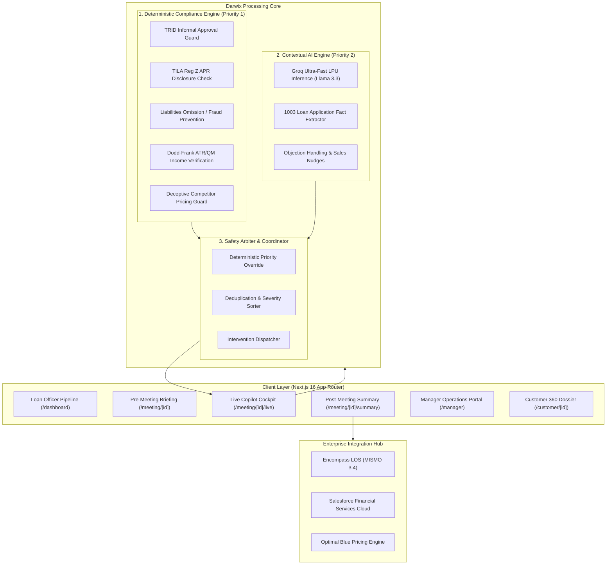
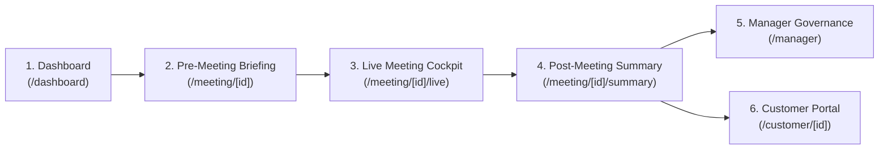

# Darwix AI — Real-Time AI Copilot for U.S. Mortgage Sales

[](https://nextjs.org/)
[](https://www.typescriptlang.org/)
[](https://tailwindcss.com/)
[](#compliance-engine)

> **Darwix AI** is an enterprise-grade real-time AI copilot engineered for U.S. Mortgage Loan Officers (MLOs), branch managers, and mortgage lending institutions. It combines ultra-low latency contextual intelligence with strict, deterministic regulatory compliance guardrails to increase sales conversion, eliminate regulatory infractions, and automate Fannie Mae Form 1003 data capture during live consultations.

---

## Executive Summary & Product Objective

In modern mortgage originations, loan officers operate in high-cognitive-load environments. During a 30-minute borrower consultation, an MLO must:
1. Establish borrower rapport and uncover financing motivations.
2. Accurately capture dozens of granular fields for the Uniform Residential Loan Application (Form 1003).
3. Handle product comparisons and pricing objections in real time.
4. Strictly comply with federal lending mandates: **CFPB TRID**, **TILA Regulation Z**, **RESPA Section 8**, **Dodd-Frank ATR/QM**, and **ECOA Fair Lending**.

A single verbal regulatory misstep—such as providing an informal approval before underwriting sign-off or quoting an interest rate without disclosing the Annual Percentage Rate (APR)—can trigger severe CFPB civil penalties, lender buybacks, and consumer deceptive practice claims.

**Darwix AI solves this by introducing a dual-engine architecture:**
- **Deterministic Compliance Engine (Priority 1)**: Sub-10ms pattern evaluation enforcing hard regulatory rules with zero tolerance for generative hallucinations.
- **Contextual AI Inference Engine (Priority 2)**: Groq-accelerated LLM reasoning for objection handling, competitive positioning, discovery questioning, and real-time 1003 fact extraction.
- **Human-in-the-Loop Governance**: Advisory-only interventions requiring explicit Loan Officer sign-off (`Accept`, `Dismiss`, `Ask Question`, `Escalate`).

---

## System Architecture



---

## Core Regulatory Scenarios Covered

The architecture provides explicit handling for high-risk mortgage consultation situations:

| Scenario / Trigger | Regulatory Authority | System Action & Intervention |
| :--- | :--- | :--- |
| **Informal Approval Statement**<br>*"You're 100% approved in my book"* | **CFPB TRID (12 CFR § 1026.19)** | **CRITICAL WARNING**: Prohibits unauthorized commitment; prompts immediate verbal retraction script and queues conditional pre-qualification letter. |
| **Indicative Rate Without APR**<br>*"I can give you a rate of 5.875%"* | **TILA Reg Z (12 CFR § 1026.24)** | **HIGH WARNING**: Mandates oral APR disclosure and disclosure that interest rates float until formal lock agreement. |
| **Omitting Liabilities / Leases**<br>*"Can we leave off Sarah's auto lease?"* | **18 U.S.C. § 1014 / Fannie Mae B3-6-01** | **CRITICAL WARNING**: Fraud prevention block. Informs borrower all debts must be declared; auto-populates lease into Form 1003 liabilities ledger. |
| **Unverifiable Cash Income**<br>*"Client paid $15,000 cash for a private job"* | **Dodd-Frank ATR/QM (12 CFR § 1026.43)** | **HIGH ALERT**: Clarifies 2-year tax return documentation requirements for self-employed income; blocks unverified cash from qualifying DTI. |
| **Unverified Competitor Guarantee**<br>*"I'll beat Rocket Mortgage by 50 bps"* | **FTC Act Section 5 / CFPB UDAAP** | **MEDIUM ADVISORY**: Prompts request for competing written Loan Estimate before binding rate matching. |

---

---

---

## Current Status: Phase 4 Implemented — ElevenLabs Voice Copilot & Audio Experience

**Phase 4 — ElevenLabs Voice Copilot & Realistic Audio Experience** is fully implemented, verified, and operational:
- **ElevenLabs High-Fidelity TTS**: Integration of the official `@elevenlabs/elevenlabs-js` SDK streaming low-latency, natural audio (`eleven_turbo_v2_5`, Rachel voice `21m00Tcm4TlvDq8ikWAM`).
- **Server-Side API Architecture**: Secure proxy route (`/api/voice/speak`) with strict boundaries (max 1,000 chars, metadata sanitization, zero browser key exposure).
- **Agent-Controlled Audio Playback**: Strictly opt-in playback controls on actionable cards (`[Play Response]`, `[Play Question]`, `[Play Suggestion]`). AI never speaks automatically to the customer.
- **Resilient Fallback Hierarchy**: Full multi-tier fallback (ElevenLabs Turbo v2.5 -> Browser SpeechSynthesis -> Non-blocking Text-Only Mode).

---

## Current Integration Status

| Tier | Services / Components | Implementation State |
| :--- | :--- | :--- |
| **LIVE** | **Groq LPU Inference**<br>**ElevenLabs TTS** | - Real Groq Cloud SDK (`llama-3.3-70b-versatile` / `llama-3.1-8b-instant`)<br>- Real ElevenLabs TTS streaming (`@elevenlabs/elevenlabs-js`, `eleven_turbo_v2_5`)<br>- Full deterministic fallback if keys are omitted |
| **SIMULATED** | **Meeting Transcript Stream**<br>**Customer Conversation**<br>**Enterprise Integrations** | - Scripted multi-party dialogue with John & Sarah Miller<br>- Real-time interval playback, speed control, and manual text injection<br>- Simulated Salesforce FSC, Encompass MISMO 3.4, and Optimal Blue adapters |
| **DEFERRED** | **Microphone Capture**<br>**Real-Time STT**<br>**Direct LOS / CRM DB** | - Production browser microphone capture (WebRTC/CTI)<br>- Production live speech-to-text (Deepgram Nova-2)<br>- Direct enterprise database connectors and bi-directional LOS sync |

---

## Voice Assistance

Darwix AI includes an optional voice assistance layer designed specifically for mortgage sales workflows:

- **ElevenLabs TTS Integration**: Generates clear, professional verbal phrasing using the official `@elevenlabs/elevenlabs-js` package with the `eleven_turbo_v2_5` low-latency model.
- **Server-Side API Architecture**: The client browser calls `POST /api/voice/speak` with sanitized text. The Next.js server validates inputs, checks authorization, queries ElevenLabs, and streams `audio/mpeg` back to the browser.
- **Optional, Agent-Controlled Playback**: Voice is strictly advisory. The loan officer reviews the suggestion card and explicitly chooses `[Play Response]` or `[Play Question]`. The copilot **never auto-speaks** to borrowers or interrupts consultations.
- **Defensive Content Normalization**: Before TTS, all markdown formatting, internal confidence scores, audit tags, and private customer identifiers are stripped.
- **Resilient Fallback Behavior**: If the ElevenLabs key is unconfigured or rate-limited, the application gracefully falls back to browser `speechSynthesis` or text-only mode with clear messaging (*"Voice assistance is temporarily unavailable. You can still use the text suggestion."*). The core copilot remains 100% operational.
- **Audited Verification**: Development-only `[Test Voice]` button in meeting settings allows safe voice testing with a fixed compliance sentence (*"Your next recommended step is to confirm the required documents."*), sending zero customer data.
- **10 Core Origination Scenarios**: Comprehensive automated handling across informal approvals, interest rate disclosures, liability omissions, undocumented income, competitor promises, borrower conflicts, profiling gaps, closing follow-ups, loan product comparisons, and turnaround objections.
- **Evidence-First Transparency**: Every intervention features an expandable evidence drawer showing the exact transcript quote, detection source (`RULE`, `AI`, or `HYBRID`), confidence score, and the unaddressed regulatory/financial risk.
- **Anti-Spam & Nudge Fatigue Memory**: Per-meeting dismissal memory suppresses repetitive non-critical notifications while ensuring critical compliance hazards are never suppressed.
- **Interactive Playback Engine**: Real-time multi-party simulation controls (`Start`, `Pause`, `Resume`, `Restart`, `0.5x / 1x / 1.5x` speed) and 1-click test triggers for all 10 scenarios.
- **Graceful Fallback**: Transparent operational banner and zero-downtime transition to local deterministic/heuristic engine when `GROQ_API_KEY` is not present or times out (>4s).

---

## Demonstrated Scenarios (10 Core Situations)

The Darwix AI Copilot natively detects, analyzes, and assists with all 10 mortgage origination scenarios:

| # | Scenario | Trigger Text / Role | Source & Severity | Regulatory Authority | Copilot Action & Nudge |
| :-: | :--- | :--- | :-: | :--- | :--- |
| **1** | **Informal Approval Statement** | *"Based on what you've told me, I think you'll definitely be approved."* (LO) | `HYBRID`<br>`HIGH` | CFPB TRID (12 CFR § 1026.19) | Warns against informal approval; prompts verbal disclaimer that approval requires completed application and underwriting review. |
| **2** | **Indicative Rate Without APR** | *"Regarding rates, we can probably get you a 6.1% rate for your 30-year fixed loan."* (LO) | `RULE`<br>`MEDIUM` | TILA Reg Z (12 CFR § 1026.24) | Enforces oral APR disclosure; clarifies that rates float until formal rate lock agreement. |
| **3** | **Potential Liability Omission** | *"We could leave that car loan off for now to make your debt-to-income look cleaner."* (LO) | `HYBRID`<br>`CRITICAL` | Fannie Mae B3-6-01 / 18 U.S.C. § 1014 | **CRITICAL FRAUD STOP**: Mandates all liabilities disclosure; freezes application; triggers automatic supervisor escalation. |
| **4** | **Undocumented Cash Income** | *"I make about $8,000 a month, but most of it isn't documented because a lot of clients pay through private cash contracts."* (Co-Borrower) | `HYBRID`<br>`HIGH` | CFPB ATR/QM (12 CFR § 1026.43) | Separates Stated ($8k) vs Verified ($0) income; flags `incomeVerificationStatus: "required"`; queues Schedule C document task. |
| **5** | **Competitor Beat Promise** | *"Don't worry, we'll beat whatever rate the other lender gives you."* (LO) | `HYBRID`<br>`HIGH` | FTC Act § 5 / CFPB UDAAP | Flags deceptive practice risk; prompts officer to request written Loan Estimate before price matching. |
| **6** | **Conflicting Borrower Info** | John states debt is $500; Sarah states: *"Wait John, that's not right. It's actually closer to $1,200 when you include my student loan and our credit cards!"* | `HYBRID`<br>`HIGH` | Fannie Mae Form 1003 ATR | Marks liabilities as `conflicted`; records both values without choosing a winner; prompts officer clarification. |
| **7** | **Missed Profiling Question** | Discovery ends without inquiry into recurring non-mortgage obligations. | `RULE`<br>`MEDIUM` | Form 1003 Section 3 Standard | Prompts officer: *"Besides the car and student loan payments we've discussed, are there any other recurring monthly financial obligations?"* |
| **8** | **Closing Without Next Action** | Meeting closes with vague statement: *"Great, I'll let you know if anything comes up."* (LO) | `RULE`<br>`MEDIUM` | Lender Sales Standard | Generates draft follow-up task: *"Send borrower secure portal link for Sarah's 2024-2025 Schedule C tax returns and schedule Thursday check-in."* |
| **9** | **Product Comparison Guidance** | Sarah asks: *"What's the difference between these mortgage options like a 30-year versus 15-year fixed for our $675,000 purchase with $85,000 down?"* | `AI`<br>`LOW` | CFPB Anti-Steering (12 CFR § 1026.36) | Contextual guidance presenting objective payment differences (~$3,570/mo vs ~$5,080/mo) and lifetime interest savings ($240k+). |
| **10** | **Customer Objection (Speed)** | John states: *"Another lender said their process will be faster and that they can close in 14 days."* | `AI`<br>`MEDIUM` | Fair Sales Best Practice | Objection handling script explaining direct underwriting milestones, appraisal waiver conditions, and avoiding false promises. |

---

## Current Limitations & Engineering Boundaries

1. **Audio Ingestion & Diarization**: Multi-party conversational stream is currently fed via simulated interval-based diarization (`DEMO_SIMULATION_SCRIPT`) and interactive phrase injection rather than live WebRTC microphone audio (scheduled for production telephony integration).
2. **Server-Side AI Runtime**: All Groq LPU calls are strictly executed server-side to guarantee that `GROQ_API_KEY` is never exposed to client bundles. When offline or unkeyed, system operates seamlessly in deterministic heuristic mode.
3. **No External Voice Synthesis**: Real-time voice synthesis (ElevenLabs) is deferred in this phase to prevent cognitive distraction in the loan officer cockpit.
4. **Advisory Boundaries**: The AI copilot never executes binding loan locks, underwriting sign-offs, or CRM writes without human-in-the-loop authorization.

---

## Core User Experience & End-to-End Journey

Darwix AI supports the full consultation lifecycle of a licensed U.S. Mortgage Loan Officer:



1. **Loan Officer Command Dashboard (`/dashboard`)**:
   - High-level pipeline metrics (Total Consultations, 1003 Readiness, Active Interventions, Pending Escalations).
   - Primary Action Card with one-click direct access to "Open Next Meeting" (`meet_001` with John & Sarah Miller).
   - Daily consultation queue with status badges (`LIVE NOW`, `UPCOMING`, `COMPLETED`) and attention flags (`TRID Attention`, `Pricing Objection`).
   - Open originations task checklist and deterministic compliance engine guard status.

2. **Pre-Meeting Briefing Dossier (`/meeting/[id]`)**:
   - Comprehensive borrower profile (John Miller, W-2 Tech Lead; Sarah Miller, Self-Employed Designer).
   - Target purchase parameters ($675,000 purchase price, $85,000 down payment, 30-year conventional fixed, 2–4 week contract timeline).
   - Key attention areas & borrower concerns (Rocket Mortgage competing quote, auto lease exclusion question, 2-year tax return verification).
   - 7-step consultation agenda timeline and high-value discovery questions.
   - Primary CTA: **"Start Meeting"** -> transitions directly to the live cockpit.

3. **3-Column Live Meeting Cockpit (`/meeting/[id]/live`)**:
   - **Meeting Control Bar**: Real-time timer, meeting channel indicator, pause/resume simulation, deterministic guard status, and action buttons (`Add Note`, `Mark Info`, `Ask Question`, `View Customer`, `End Meeting`).
   - **Left Column (30%) — Transcript & Dialogue**: Real-time diarized speech bubbles (`Loan Officer`, `Primary Borrower`, `Co-Borrower`), simulated audio visualizer, compliance highlight pills, and interactive **Scenario Injector** for rapid testing.
   - **Center Column (40%) — Customer 360 & 1003 Matrix**: Financial profile overview, Form 1003 completeness checklist, open discovery questions, and real-time extracted fact ledger with Encompass field mappings.
   - **Right Column (30%) — Darwix Copilot Interventions**: Live deck of actionable cards organized by severity (`critical`, `high`, `medium`, `info`). One-click actions to use safe scripts, stage questions, view transcript evidence, dismiss with audit rationale, or escalate to supervision.

4. **Post-Meeting Summary & LOS/CRM Sync (`/meeting/[id]/summary`)**:
   - Executive meeting summary and structured recap (Customer Goals, Financial Findings, Mortgage Discussion).
   - Form 1003 Captured Facts Ledger vs. Missing Information required for underwriting.
   - Compliance Interventions Recap (alerts raised, resolved, escalated) and immutable audit event ledger.
   - Actionable follow-up tasks with priority indicators and due dates.
   - Recommended next step banner ("Issue Conditional Pre-Qualification Letter").
   - One-click **"Sync to Encompass & CRM"** button triggering realistic MISMO 3.4 XML and Salesforce event simulation.

5. **Lending Operations & Manager Dashboard (`/manager`)**:
   - Branch KPI metrics (Active Pipeline, Form 1003 Accuracy, TRID Compliance Rate, Escalations Requiring Review).
   - Loan Officer performance leaderboard tracking consultation volume and compliance scores.
   - Supervisor escalation queue with interactive mitigation review and sign-off modal for regulatory alerts.
   - Branch activity stream recording real-time meeting milestones and LOS syncs.

6. **Customer-Facing Borrowing Portal (`/customer/[id]`)**:
   - Clean, transparent borrower interface strictly isolated from internal compliance scoring, risk flags, or private loan officer notes.
   - Visual mortgage journey progress stepper (`Consultation -> Document Review -> Pre-Approval -> Underwriting -> Clear to Close`).
   - Profile completion score and interactive document upload checklist.
   - Loan Officer contact card with phone, email, and meeting booking options.

7. **Origination Directories**:
   - **Meetings Pipeline (`/meetings`)**: Searchable and filterable queue of all scheduled, active, and completed consultation sessions.
   - **Client Directory (`/customers`)**: Borrower portfolio with credit scores, stage indicators, and quick links to dossiers.
   - **Task Board (`/tasks`)**: Comprehensive origination task queue filterable by priority and assignee with batch sync controls.

---

## Current Mocked Components (Phase 2 Prototype)

In Phase 2, all core experiences run on deterministic mock components to ensure high-fidelity demonstration without third-party network flakiness:

| Component | Prototype Implementation | Future Production Target (Phase 3+) |
| :--- | :--- | :--- |
| **Live Transcript Stream** | Pre-scripted multi-turn consultation between MLO Alex Vance and John & Sarah Miller with live interval playback and scenario injector. | Deepgram / LiveKit real-time dual-channel audio streaming with WebSockets. |
| **AI Interventions** | Deterministic rule coordinator evaluating transcript segments against TRID, TILA, ATR/QM, and RESPA rules with pre-computed suggested responses. | Groq LPU Llama 3.3 70B inference orchestrator running alongside deterministic rules. |
| **Customer & 1003 Data** | Singleton `MortgageRepository` pre-populated with 4 realistic borrower personas (Miller, Carter, Johnson, Garcia). | PostgreSQL database managed via Prisma ORM with encrypted PII columns. |
| **Manager Metrics & Audit** | In-memory audit event stream and branch performance metrics. | Kafka / EventBridge event streaming to centralized enterprise compliance data lake. |
| **LOS & CRM Sync** | Simulated adapter dispatching structured MISMO 3.4 XML and Salesforce payloads with visual progress feedback. | Encompass Developer Connect REST APIs & Salesforce Financial Services Cloud API. |

---

## 3-Column Live Meeting Cockpit Structure

The live consultation interface (`/meeting/[id]/live`) is engineered for rapid visual scanning and low cognitive friction:

- **LEFT COLUMN (30%) — Live Conversation Stream**: Dual-channel speaker diarization (`Loan Officer`, `Primary Borrower`, `Co-Borrower`), simulated audio visualizer, real-time transcript streaming, and compliance trigger badges.
- **CENTER COLUMN (40%) — Customer & Meeting Context**: Instant borrower dossier (John & Sarah Miller), live 1003 fact verification ledger, and interactive scenario & payment calculator (LTV, DTI, PITI breakdown).
- **RIGHT COLUMN (30%) — Darwix AI Copilot**: Actionable intervention card deck sorted by severity (`critical`, `high`, `medium`, `info`). Supports **Accept**, **Dismiss** (with mandatory compliance justification), **Ask Nudge**, **View Evidence**, and **Escalate**.

---

## Enterprise Integrations Hub

Darwix AI is designed with decoupled adapter contracts ready for enterprise deployment:
- **Encompass by ICE Mortgage Technology**: Bidirectional Fannie Mae MISMO 3.4 XML payload generation and condition synchronization.
- **Salesforce Financial Services Cloud (FSC)**: Real-time consultation activity logging, lead stage updates, and automated follow-up task dispatching.
- **Optimal Blue PPE**: Real-time secondary marketing rate queries.

---

## Repository Structure

```
/
├── app/                        # Next.js 16 App Router
│   ├── dashboard/              # Loan Officer Pipeline & Metrics Command Center
│   ├── meetings/               # Meetings Pipeline Directory
│   ├── meeting/[id]/           # Pre-meeting preparation briefing dossier
│   │   ├── live/               # 3-Column Live Meeting Cockpit
│   │   └── summary/            # Post-meeting recap & integration sync
│   ├── customers/              # Borrower Client Portfolio Directory
│   ├── customer/[id]/          # Customer 360 borrower-facing portal
│   ├── tasks/                  # Origination & compliance task queue
│   ├── manager/                # Lending operations & compliance portal
│   └── api/                    # Server-side API route handlers
├── components/
│   ├── copilot/                # Actionable intervention cards & deck
│   ├── customer/               # Borrower profiles & 1003 ledger
│   ├── layout/                 # Global AppShell, Sidebar, TopHeader
│   ├── meeting/                # Transcript viewer, messages & audio visualizers
│   ├── shared/                 # Design system primitives (Badge, Button, Card, etc.)
│   └── voice/                  # CopilotVoicePlayer, VoiceSettingsControl, VoiceContext
├── lib/
│   ├── ai/                     # Groq LLM inference client & prompts
│   ├── compliance/             # Deterministic compliance rule engine
│   ├── interventions/          # Coordinator, arbiter, and action handlers
│   ├── meeting/                # Meeting manager & state store
│   ├── voice/                  # Centralized ElevenLabs configuration & text normalization
│   ├── integrations/           # Encompass LOS & Salesforce CRM adapters
│   ├── data/                   # In-memory repository & synthetic mock datasets
│   ├── validation/             # Zod validation schemas
│   └── utils/                  # Currency, percentage, and date utilities
├── types/                      # Comprehensive TypeScript domain models
└── docs/
    ├── ARCHITECTURE.md         # Full architecture specification & Mermaid diagrams
    ├── PRODUCT_DECISIONS.md    # Architecture decision records (ADRs)
    └── VOICE.md                # ElevenLabs voice copilot specification & security guide
```

---

## Getting Started

### Prerequisites
- Node.js 18.17+ or 20+ (tested on Node v22.18.0)
- npm or pnpm

### Installation

1. Clone repository:
   ```bash
   git clone https://github.com/Roushan0012/mortgage-ai-copilot.git
   cd mortgage-ai-copilot
   ```

2. Install dependencies:
   ```bash
   npm install
   ```

3. Configure Environment Variables:
   Copy the provided `.env.example` file to `.env.local`:
   ```bash
   cp .env.example .env.local
   ```
   Edit `.env.local` to add optional keys:
   ```env
   GROQ_API_KEY=your_groq_api_key_here
   ELEVENLABS_API_KEY=your_elevenlabs_key_here
   ```
   > **Note**: If `GROQ_API_KEY` is omitted, Darwix AI gracefully operates in deterministic offline heuristic mode with zero downtime for local demonstration and testing.

4. Start Development Server:
   ```bash
   npm run dev
   ```
   Open [http://localhost:3000](http://localhost:3000) in your browser.

---

## Validation & Code Quality

Run the verification test suite before committing:

```bash
# 1. Run unit & integration test suite (all 10 scenarios)
npm test

# 2. Typecheck TypeScript models and routes
npm run typecheck

# 3. Lint project files
npm run lint

# 4. Compile optimized production build
npm run build
```

---

## Security & Privacy Compliance

- **Gramm-Leach-Bliley Act (GLBA) Safeguards**: All synthetic test borrower data masks Nonpublic Personal Information (`***-**-6789`).
- **Zero Client Credential Leakage**: API secrets (`GROQ_API_KEY`, `ELEVENLABS_API_KEY`) reside exclusively in server-side runtime environments and are strictly excluded from client-side bundles.
- **Immutable Audit Trail**: All compliance alerts, officer overrides, and dismissed nudges require auditable justifications recorded to the compliance ledger.

---

## License

Enterprise Assessment Prototype — Proprietary & Confidential.
