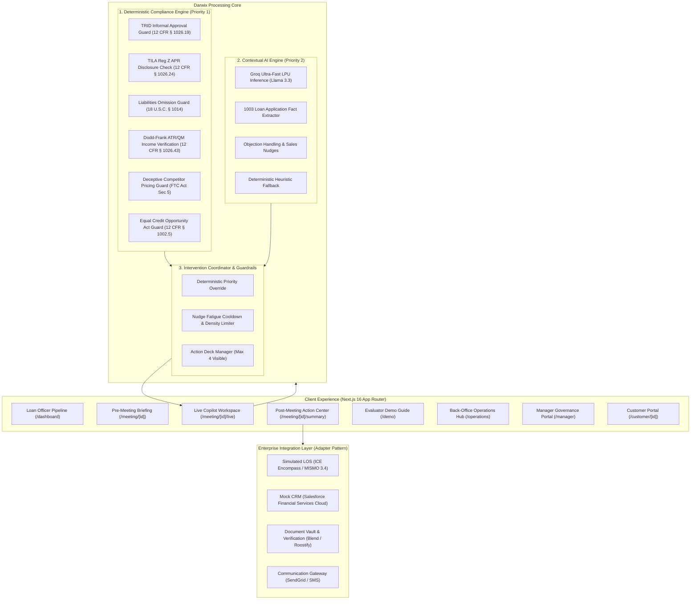

# Darwix AI — Enterprise Real-Time AI Copilot for U.S. Mortgage Sales

Darwix AI is a real-time compliance and sales intelligence copilot engineered for U.S. Mortgage Loan Officers (MLOs), branch managers, back-office operations teams, and lending institutions. It couples deterministic regulatory rules executing in sub-10ms with contextual large language model reasoning to improve borrower conversion, ensure strict compliance with federal lending mandates, and automate Fannie Mae Form 1003 data capture and post-meeting enterprise workflows.

---

## 1. Project Overview

In residential mortgage origination, loan officers conduct high-stakes consultations where they must rapidly analyze complex borrower financial situations, compare conforming loan options, handle turnaround and rate objections, and capture dozens of structured data fields. A single verbal misstatement—such as an informal pre-approval promise or quoting an interest rate without disclosing the Annual Percentage Rate (APR)—creates severe regulatory exposure under CFPB TRID, TILA Regulation Z, and Dodd-Frank ATR/QM rules.

Darwix AI solves this challenge through an advisory copilot architecture where:
- **Deterministic Rules (Priority 1)** evaluate regulatory constraints in sub-10ms with absolute precedence.
- **Contextual AI Inference (Priority 2)** generates sales coaching, objection responses, and structured Form 1003 fact extraction.
- **Human-in-the-Loop Governance** guarantees that no loan approval, rate lock, financial mutation, or external customer communication occurs without explicit loan officer review and approval.

---

## 2. The Problem in Mortgage Sales

1. **High In-Call Cognitive Load**: Loan officers must actively listen, build trust, calculate front-end/back-end DTI ratios, probe for unstated liabilities, and compare loan products simultaneously.
2. **Regulatory Risk & Inadvertent Non-Compliance**: Verbal representations made during phone calls can trigger civil penalties, mandatory borrower restitution, or lender buybacks under TRID and TILA.
3. **Data Integrity & Stated vs. Verified Confusion**: Income mentioned verbally during a call is often prematurely treated as qualifying income, creating underwriting friction when self-employed borrowers lack two years of tax returns.
4. **Post-Meeting Administrative Drag**: After each 30-minute call, loan officers spend 45–60 minutes manually updating Salesforce CRM, drafting Form 1003 in Encompass, building document request checklists, and sending follow-up emails.

---

## 3. The Solution: Darwix AI Architecture



---

## 4. Product Journey & User Personas

| User Persona | Primary Route | Core Capabilities |
|---|---|---|
| **Loan Officer (Agent)** | `/dashboard`<br>`/meeting/[id]/live`<br>`/meeting/[id]/summary` | Pre-call preparation, live conversation stream with Copilot guidance, suggested responses, Form 1003 fact ledger, and post-meeting Action Center. |
| **Branch Manager** | `/manager` | Branch-wide compliance risk index, active escalation resolution queue, loan officer adoption metrics, and customer conversion funnel. |
| **Operations Specialist** | `/operations` | Back-office document triage, stated-vs-verified income reconciliation, conflicting liabilities resolution ($500 vs $1,200), and integration exception logs. |
| **Borrower (Customer)** | `/customer/[id]` | Transparent 6-stage milestone tracker, document upload portal, and direct loan officer contact. Excludes internal risk metadata or underwriter notes. |
| **Evaluator / Auditor** | `/demo` | 15-stage guided roadmap covering the entire mortgage consultation lifecycle with 1-click clean state reset. |

---

## 5. Dual-Engine AI Intervention Engine

### 15-Stage Intervention Pipeline
1. **Audio / Transcript Ingestion**: Multi-speaker diarized transcript stream with timestamps.
2. **Text Normalization**: Strips conversational filler, normalizes smart quotes, and verifies speaker roles.
3. **Deterministic Compliance Rules**: Hard-coded regex and multi-turn state checks evaluate in sub-10ms.
4. **Contextual AI Inference**: Groq LPU evaluates conversational nuance with a 4-second timeout.
5. **Deterministic Precedence Override**: If a deterministic rule matches, it completely overrides any LLM output for that category.
6. **Low-Confidence AI Moderation**: Inferences <0.50 are suppressed; inferences 0.50–0.69 are clamped to 'low' severity and prepended with *"Possible issue detected — verify before acting."*
7. **Severity Clamping**: Generative AI output is restricted to at most `HIGH`; only deterministic compliance rules can issue `CRITICAL` infractions.
8. **Intervention Construction**: Creates fully typed `AIIntervention` objects with evidence quotes and citations.
9. **Deduplication & Anti-Spam Memory**: Suppresses previously dismissed non-critical categories for the remainder of the session.
10. **Cooldown Throttling**: Applies a minimum 3,000ms cooldown to non-critical suggestions.
11. **Severity Priority Ranking**: Sorts queue: `CRITICAL > HIGH > MEDIUM > LOW > INFO`.
12. **Density Limiter**: Visible active pending deck is clamped to at most 4 cards.
13. **Action Presentation**: Renders card with collapsible evidence drawer (quote, source, regulation, risk).
14. **Officer Action Execution**: Officer chooses `Accept`, `Dismiss`, `Escalate`, `Ask Question`, or `Mark for Verification`.
15. **Audit Logging & State Update**: Emits immutable audit event and synchronizes customer/meeting financial profile.

---

## 6. Enterprise Integrations: Mocked vs. Future

| Integration | Adapter | Current Status | Description & Operational Boundary |
|---|---|---|---|
| **Salesforce Financial Services Cloud** | `lib/integrations/crm/` | **MOCKED** | Simulates Lead creation, stage progression to 'Meeting Completed', activity logging (`CRM-ACT-20891`), and follow-up tasks (`CRM-TASK-30912`). |
| **ICE Encompass LOS** | `lib/integrations/los/` | **MOCKED** | Formats valid MISMO 3.4 XML/JSON Form 1003 drafts (`ENC-1003-99412`). Clamps stage progression to 'Documentation Pending'; blocks automated underwriting approval. |
| **Document Vault (Blend / Roostify)** | `lib/integrations/documents/` | **MOCKED** | Generates profile-aware verification checklists (`DOC-REQ-88201`); updates item statuses across Customer Portal and Operations Hub. |
| **Communication Gateway (SendGrid / SMS)** | `lib/integrations/communications/` | **MOCKED** | Generates customer notification drafts (`COMM-MSG-90214`); rejects dispatch without valid `approvedByOfficerId`. |
| **Tri-Merge Credit Bureau** | `lib/integrations/types.ts` | **FUTURE** | Specification complete; interface defined for Equifax, Experian, and TransUnion pulls post-pilot. |
| **Automated Underwriting (Fannie Mae DU)** | `lib/integrations/types.ts` | **FUTURE** | Specification complete; manual underwriter review remains mandatory. |

---

## 7. Regulatory Compliance & Deterministic Precedence

The engine enforces strict federal lending regulations. Compliance rules run locally and never depend on third-party cloud availability:

1. **CFPB TRID Pre-Approval Standards (12 CFR § 1026.19)**: Flags informal approval statements (`"You should be approved"`). Suggested message: *"Approval has not been established from this meeting. Avoid representing the customer as approved before the required underwriting and verification process."*
2. **TILA Regulation Z Oral Disclosures (12 CFR § 1026.24)**: Flags interest rate quotes without APR. Suggested message: *"Treat this as indicative only unless supported by an approved rate source and applicable eligibility conditions."*
3. **Mortgage Fraud / Liability Omission (18 U.S.C. § 1014 / Fannie Mae B3-6-01)**: Flags suggestions to omit recurring debts as `CRITICAL`. Suggested message: *"Do not omit or misrepresent an existing liability. Capture the obligation accurately and follow the required verification process."*
4. **Dodd-Frank Ability-to-Repay / ATR Rule (12 CFR § 1026.43)**: Flags undocumented cash income as `STATED` and excludes it from DTI until 2 years of tax returns are verified.
5. **FTC Act Section 5 / CFPB UDAAP**: Flags unsubstantiated competitor beat guarantees as `HIGH` severity.
6. **Conflicting Borrower Information**: Detects multi-speaker debt discrepancies ($500 vs $1,200) and marks them `CONFLICTED` without choosing an arbitrary winner.
7. **Equal Credit Opportunity Act (ECOA / 12 CFR § 1002.5)**: Prohibits demographic inquiries regarding family planning or marital status outside standard Form 1003 fields.

---

## 8. Voice Assistance (ElevenLabs TTS Pipeline)

- **Purpose**: Enables the loan officer to listen to suggested responses and consultative coaching scripts via audio.
- **Server-Side Security**: All ElevenLabs API requests route through `POST /api/voice/speak`. API keys are never exposed to browser code.
- **Text Normalization**: Strips markdown, bracketed tags, UI labels, and confidence numbers prior to synthesis.
- **Selective Filtering**: Audio playback is restricted to consultative guidance and objection handling; compliance alerts remain visual to avoid audio interference.
- **Graceful Fallback**: If `ELEVENLABS_API_KEY` is not configured or character limits are exceeded, the UI displays clear text suggestions without interruption.

---

## 9. Evaluator Demo Guide (`/demo`) & Reset

A guided demonstration route is available at `/demo`.

### 15-Stage Evaluation Flow
1. **Pre-Meeting Brief** (`/meeting/meet_001`): Review borrower profile and agenda.
2. **Start Live Meeting** (`/meeting/meet_001/live`): Launch 3-column synchronous cockpit.
3. **Play Simulated Transcript**: Run 16-turn benchmark transcript.
4. **Inspect AI Interventions**: Observe real-time TRID, TILA, and ATR compliance cards.
5. **Agent Actions**: Test `Accept`, `Dismiss` (with rationale), `Escalate`, and `Ask Question`.
6. **End Meeting**: Transition consultation session to post-meeting summary.
7. **Generate Executive Summary** (`/meeting/meet_001/summary`): Review 19 summary facets.
8. **Action Center Triage**: Inspect drafted enterprise actions.
9. **Approve CRM Update**: Officer reviews modal and approves Salesforce sync (`CRM-ACT-20891`).
10. **Approve LOS Update**: Officer approves Form 1003 draft in MISMO 3.4 (`ENC-1003-99412`).
11. **Dispatch Document Package**: Dispatch borrower upload checklist (`DOC-REQ-88201`).
12. **Review Follow-Ups**: Verify tasks assigned to officer and borrower.
13. **Manager Dashboard** (`/manager`): Review compliance health and escalation resolution.
14. **Operations Hub** (`/operations`): Triage document verification and debt conflicts.
15. **Audit Trail**: Verify immutable audit records and idempotency keys.

### Demo Reset
Clicking **"Reset Demo"** on `/demo` or in the Live Workspace header triggers `POST /api/demo/reset`. This clears all pending approvals, sync states, intervention cards, and audit logs, returning the system to its initial seed state without touching configuration or environment variables.

---

## 10. Environment Configuration

The application is fully functional in offline/mock mode without third-party API credentials. To enable live cloud LLM reasoning or voice assistance, configure `.env`:

```bash
# Optional: Groq Cloud LPU (Contextual LLM Reasoning)
GROQ_API_KEY=gsk_your_groq_api_key_here

# Optional: ElevenLabs TTS (Audio Voice Coaching)
ELEVENLABS_API_KEY=xi_your_elevenlabs_api_key_here
ELEVENLABS_VOICE_ID=21m00Tcm4TlvDq8ikWAM
ELEVENLABS_MODEL_ID=eleven_monolingual_v1
```

> **Security Mandate**: Never prefix secret keys with `NEXT_PUBLIC_`. The `.gitignore` file strictly excludes `.env`, `.env.local`, and all secret files.

---

## 11. Verification & Automated Testing

The repository contains 44 automated unit and integration tests across 5 test suites.

```bash
# Run all test suites
npm test

# Run code linter
npm run lint

# Run TypeScript typecheck
npm run typecheck

# Build for production
npm run build
```

### Test Coverage Areas
1. **`tests/assessment-hardening.test.ts`**: Verifies all 14 required intervention categories, exact high-risk messages, and demo reset invariants.
2. **`tests/integrations.test.ts`**: Verifies adapter registry, stated-vs-verified financial isolation, LOS defensive clamping, approval gate validation, and idempotency caching.
3. **`tests/intervention-engine.test.ts`**: Verifies 10 core production scenarios and deterministic regex accuracy.
4. **`tests/pipeline-guardrails.test.ts`**: Verifies anti-spam deduplication, dismissal memory, and Zod schema validation.
5. **`tests/voice-engine.test.ts`**: Verifies ElevenLabs request sanitization, text normalization, and audio stream headers.

---

## 12. Known Operational Boundaries & Limitations

1. **Simulated Enterprise Endpoints**: The Salesforce and Encompass adapters run in local mock mode. Production integration requires enterprise OAuth2 credentials and firewall configuration.
2. **Ephemeral Call Audio**: In accordance with Gramm-Leach-Bliley Act (GLBA) and wiretap consent standards, raw call audio is processed transiently in memory and is not stored permanently.
3. **Credit Bureau Gateway**: Tri-merge credit pull interfaces are specified in `types/` but marked `FUTURE` pending live bureau credentialing.
4. **Automated Underwriting (DU/LPA)**: AUS decisioning is marked `FUTURE`; human underwriter review remains mandatory on all files.

---

## 13. Assessment Traceability Matrix

Complete requirements traceability is documented in [`docs/ASSESSMENT_TRACEABILITY.md`](file:///Users/roushan_iiitbgp/Desktop/Mortgage-ai-copilot/docs/ASSESSMENT_TRACEABILITY.md). Additional supporting specifications include:
- [`docs/ADVANCED_SCENARIOS.md`](file:///Users/roushan_iiitbgp/Desktop/Mortgage-ai-copilot/docs/ADVANCED_SCENARIOS.md): Behavioral test matrix for all 8 high-risk scenarios.
- [`docs/PILOT_PRIORITIZATION.md`](file:///Users/roushan_iiitbgp/Desktop/Mortgage-ai-copilot/docs/PILOT_PRIORITIZATION.md): 2-week-before-pilot tradeoff decisions.
- [`docs/RESEARCH_AND_ASSUMPTIONS.md`](file:///Users/roushan_iiitbgp/Desktop/Mortgage-ai-copilot/docs/RESEARCH_AND_ASSUMPTIONS.md): Domain context and labeled assumptions.
- [`docs/METRICS.md`](file:///Users/roushan_iiitbgp/Desktop/Mortgage-ai-copilot/docs/METRICS.md): North Star metric, operational metrics, and guardrail metrics.
- [`docs/FINAL_ASSESSMENT_CHECKLIST.md`](file:///Users/roushan_iiitbgp/Desktop/Mortgage-ai-copilot/docs/FINAL_ASSESSMENT_CHECKLIST.md): 7-dimension assessment scorecard.
