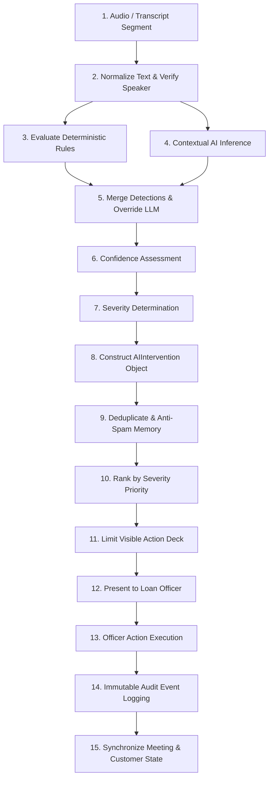

# Darwix AI — Real-Time AI Intervention Engine Documentation

## Executive Overview
The Darwix AI Copilot operates as a real-time compliance and sales advisory engine for U.S. residential mortgage consultations. It utilizes a **Hybrid AI Architecture** where **deterministic compliance rules** execute with sub-10ms latency and absolute precedence over **contextual Large Language Model (LLM) reasoning** powered by Groq.

This document specifies the 10 core mortgage scenarios, the 15-stage intervention pipeline, evidence transparency standards, anti-spam mechanisms, and safety guardrails.

---

## 15-Stage Intervention Pipeline

1. **Transcript Ingestion**: Ingests real-time multi-party diarized transcript segments with speaker attribution and confidence scores.
2. **Text Normalization**: Strips conversational artifacts, cleans smart quotes, collapses whitespace, and identifies speaker roles.
3. **Deterministic Compliance Rules**: Executes regex and multi-turn state checks across 8 strict federal regulatory rules in <10ms.
4. **Contextual AI Inference**: Evaluates conversational context via Groq LLM (or deterministic heuristic fallback if offline/timed out) within a 4-second timeout.
5. **Detection Merging & Override**: If a deterministic rule triggers for a category, it takes absolute precedence; raw LLM output cannot override or downgrade deterministic rule detections.
6. **Confidence Assessment**: Maps numerical confidence to categorical bands (`HIGH >= 0.85`, `MEDIUM >= 0.60`, `LOW < 0.60`). Low-confidence AI suggestions (< 0.60) are suppressed; deterministic rules are never suppressed.
7. **Severity Determination**: Establishes severity (`CRITICAL`, `HIGH`, `MEDIUM`, `LOW`, `INFO`). Generative AI output is strictly clamped to at most `HIGH`; only deterministic compliance rules can issue `CRITICAL` violations.
8. **Intervention Construction**: Creates a fully typed `AIIntervention` object with detected evidence, regulatory citations, unaddressed risks, and corrective actions.
9. **Deduplication & Anti-Spam Memory**: Checks against active cards in the current deck. If an identical category was previously dismissed by the loan officer in the session, subsequent non-critical triggers are suppressed to prevent nudge fatigue.
10. **Severity Ranking**: Sorts interventions with strict priority: `CRITICAL > HIGH > MEDIUM > LOW > INFO`.
11. **Action Deck Limiting**: Ensures the officer is presented with manageable, non-distracting cognitive loads.
12. **Evidence-First Presentation**: Displays card in the Copilot Action Deck with a collapsible evidence drawer showing exact quote, source, and risk if unaddressed (no internal chain-of-thought).
13. **Officer Action Execution**: Enables officer to `Accept`, `Dismiss` (with mandatory audit rationale), `Ask Question`, `Mark Verification`, `Mark Review`, `Create Follow-up`, or `Escalate`.
14. **Immutable Audit Logging**: Emits uppercase audit events (`INTERVENTION_SHOWN`, `INTERVENTION_ACCEPTED`, `INTERVENTION_DISMISSED`, `INTERVENTION_ESCALATED`, `QUESTION_SUGGESTED`, `FIELD_MARKED_FOR_VERIFICATION`, `FOLLOWUP_CREATED`).
15. **State Synchronization**: Automatically updates meeting notes, Form 1003 ledger fields, follow-up task queues, and customer profile status.

---

## The 10 Core Production Scenarios

### Scenario 1: Informal Approval Statement
- **Identifier**: `COMP-TRID-001`
- **Mortgage Context**: Loan officers frequently express optimism to build rapport. However, stating or implying loan approval prior to official underwriter review creates binding lender liability and violates TRID rules.
- **Trigger Statement**: Alex Vance: *"Based on what you've told me, I think you'll definitely be approved."*
- **Speaker**: `loan_officer`
- **Intervention Type**: `WARNING`
- **Source**: `HYBRID` (Deterministic rule match + contextual verification)
- **Severity**: `HIGH`
- **Confidence**: `0.96` (`HIGH`)
- **Regulation Citation**: `12 CFR § 1026.19 (TRID) / TILA Section 128`
- **Regulatory Authority**: CFPB
- **Exact Nudge Message**: *"An informal approval statement was made. Clarify that formal approval requires completed application and underwriting review."*
- **Reason**: Stating or implying that a borrower is approved without verified credit, income, and asset documentation violates TRID regulations and creates binding promissory estoppel exposure for the lender.
- **Suggested Response**: *"Based on our preliminary conversation, you appear to meet the initial guidelines, but formal approval requires underwriting review of your completed application and documentation."*
- **Evidence Shown in Drawer**: 
  - **Quote**: `Alex Vance: "Based on what you've told me, I think you'll definitely be approved."`
  - **Source**: `HYBRID Engine (Rule COMP-TRID-001)`
  - **Confidence**: `96% (High Confidence)`
  - **Unaddressed Risk**: Potential borrower reliance claim, CFPB examination finding, civil liability under state consumer protection statutes.
- **Available Agent Actions**: `accept`, `view_evidence`, `dismiss`
- **System Action**: Log audit warning; update meeting compliance risk index.
- **Escalation Required**: `false`
- **Low-Confidence Behavior**: If confidence drops below threshold, still flag if exact regex matches.

---

### Scenario 2: Indicative Interest Rate Quoting
- **Identifier**: `COMP-TILA-002`
- **Mortgage Context**: Quoting a specific note rate without providing the corresponding Annual Percentage Rate (APR), discount points, and loan terms violates federal advertising and disclosure requirements.
- **Trigger Statement**: Alex Vance: *"Regarding rates, we can probably get you a 6.1% rate for your 30-year fixed loan."*
- **Speaker**: `loan_officer`
- **Intervention Type**: `WARNING`
- **Source**: `RULE`
- **Severity**: `MEDIUM`
- **Confidence**: `0.98` (`HIGH`)
- **Regulation Citation**: `12 CFR § 1026.24 (TILA Advertising & Rate Disclosures)`
- **Regulatory Authority**: CFPB / FTC
- **Exact Nudge Message**: *"A specific interest rate was quoted. State that rates depend on borrower profile, loan terms, and market conditions, or pair it with the corresponding APR."*
- **Reason**: TILA § 1026.24 strictly forbids quoting simple interest rates without equal or greater prominence given to the Annual Percentage Rate (APR), term, and discount points.
- **Suggested Response**: *"Rates can vary based on the borrower's profile, loan details, market conditions, and applicable terms."*
- **Evidence Shown in Drawer**:
  - **Quote**: `Alex Vance: "Regarding rates, we can probably get you a 6.1% rate for your 30-year fixed loan."`
  - **Source**: `Deterministic Rule Engine (COMP-TILA-002)`
  - **Confidence**: `98% (High Confidence)`
  - **Unaddressed Risk**: CFPB audit sanction, mandatory borrower restitution, civil money penalties under TILA.
- **Available Agent Actions**: `accept`, `view_evidence`, `dismiss`
- **System Action**: Flag unquoted APR in compliance ledger.
- **Escalation Required**: `false`
- **Low-Confidence Behavior**: N/A (Deterministic rule always passes).

---

### Scenario 3: Potential Liability Omission (Exclusion of Debt)
- **Identifier**: `COMP-FRAUD-003`
- **Mortgage Context**: Attempting or advising a borrower to omit an existing debt obligation from Form 1003 constitutes mortgage fraud under federal statute and secondary market seller/servicer guidelines.
- **Trigger Statement**: Alex Vance: *"We could leave that car loan off for now to make your debt-to-income look cleaner."*
- **Speaker**: `loan_officer`
- **Intervention Type**: `WARNING`
- **Source**: `HYBRID`
- **Severity**: `CRITICAL` (Mandatory maximum priority)
- **Confidence**: `0.99` (`HIGH`)
- **Regulation Citation**: `Fannie Mae Selling Guide B3-6-01 / 18 U.S.C. § 1014 (Mortgage Fraud)`
- **Regulatory Authority**: Fannie Mae / Freddie Mac / DOJ
- **Exact Nudge Message**: *"Agent suggested omitting an existing debt obligation. All debts must be fully disclosed on Form 1003 to comply with federal lending laws."*
- **Reason**: Omitting liabilities artificially lowers the Debt-to-Income (DTI) ratio, violating federal ability-to-repay rules and constituting federal loan fraud under 18 U.S.C. § 1014.
- **Suggested Response**: *"All active liabilities and loans must be included on the application. We can explore options like paying off the balance or looking at different loan programs if DTI is tight."*
- **Evidence Shown in Drawer**:
  - **Quote**: `Alex Vance: "We could leave that car loan off for now to make your debt-to-income look cleaner."`
  - **Source**: `HYBRID Engine (Rule COMP-FRAUD-003)`
  - **Confidence**: `99% (High Confidence)`
  - **Unaddressed Risk**: Criminal liability under 18 U.S.C. § 1014, repurchase demand from Fannie Mae, immediate NMLS license revocation.
- **Available Agent Actions**: `accept`, `view_evidence`, `escalate`
- **System Action**: `FREEZE_APPLICATION_SUBMISSION` (Application locked until compliance officer review).
- **Escalation Required**: `true` (Alerts Branch Compliance Supervisor immediately).
- **Low-Confidence Behavior**: Even with partial match, flagged as high alert due to critical regulatory liability.

---

### Scenario 4: Undocumented / Unverifiable Cash Income
- **Identifier**: `COMP-ATR-004`
- **Mortgage Context**: Borrowers often report side gigs, cash earnings, or non-W-2 revenue that cannot be verified via official tax transcripts. Under Dodd-Frank Ability-to-Repay, unverified funds cannot be used to qualify for a QM loan.
- **Trigger Statement**: Sarah Miller: *"I make about $8,000 a month, but most of it isn't documented because a lot of clients pay through private cash contracts."*
- **Speaker**: `co_borrower`
- **Intervention Type**: `CAPTURE`
- **Source**: `HYBRID`
- **Severity**: `HIGH`
- **Confidence**: `0.95` (`HIGH`)
- **Regulation Citation**: `12 CFR § 1026.43 (CFPB Ability-to-Repay & Qualified Mortgage Rule)`
- **Regulatory Authority**: CFPB
- **Exact Nudge Message**: *"Income was discussed but may not be fully verifiable. Capture the stated amount separately from verified income and identify the documentation needed."*
- **Reason**: Ability-to-Repay standards mandate third-party documentation for qualifying income. Stated income cannot be counted toward DTI until verified via 2 years of tax returns (Schedule C/1040) or official transcripts.
- **Suggested Response**: *"We will note your stated monthly income of $8,000, and will request your 2024 and 2025 tax returns to confirm the qualifying income for underwriting."*
- **Evidence Shown in Drawer**:
  - **Quote**: `Sarah Miller: "I make about $8,000 a month, but most of it isn't documented because a lot of clients pay through private cash contracts."`
  - **Source**: `HYBRID Engine (Rule COMP-ATR-004)`
  - **Confidence**: `95% (High Confidence)`
  - **Unaddressed Risk**: Qualified Mortgage safe harbor forfeiture, loan repurchase demand from investor, underwriting suspension.
- **Available Agent Actions**: `mark_verification`, `ask_question`, `view_evidence`
- **System Action**: `FLAG_UNVERIFIED_INCOME_CONDITION` (Records $8,000 as `statedMonthlyIncome`, sets `incomeVerificationStatus = "required"`, generates document task for 2024-2025 Schedule C).
- **Escalation Required**: `false`
- **Low-Confidence Behavior**: Handled as soft reminder to verify income documentation.

---

### Scenario 5: Competitor Beat Promise
- **Identifier**: `COMP-UDAAP-005`
- **Mortgage Context**: Promising to unconditionally beat any competitor rate without seeing their official Loan Estimate or verifying rate lock status constitutes deceptive practice under FTC and CFPB rules.
- **Trigger Statement**: Alex Vance: *"Don't worry, we'll beat whatever rate the other lender gives you."*
- **Speaker**: `loan_officer`
- **Intervention Type**: `WARNING`
- **Source**: `HYBRID`
- **Severity**: `HIGH`
- **Confidence**: `0.94` (`HIGH`)
- **Regulation Citation**: `FTC Act Section 5 / CFPB UDAAP & Secondary Marketing Policy`
- **Regulatory Authority**: FTC / CFPB
- **Exact Nudge Message**: *"This statement may create an unsupported commitment to beat a competitor's offer. Use factual, supportable language instead."*
- **Reason**: Promising to beat an unverified competitor quote creates regulatory exposure under FTC Act Section 5 (deceptive practices) and risks committing the lender to negative margin loans.
- **Suggested Response**: *"We'd be happy to compare the available terms with the other offer and explain the differences."*
- **Evidence Shown in Drawer**:
  - **Quote**: `Alex Vance: "Don't worry, we'll beat whatever rate the other lender gives you."`
  - **Source**: `HYBRID Engine (Rule COMP-UDAAP-005)`
  - **Confidence**: `94% (High Confidence)`
  - **Unaddressed Risk**: UDAAP examination citation, unhedgeable secondary marketing pricing losses.
- **Available Agent Actions**: `accept`, `view_evidence`, `dismiss`
- **System Action**: `GENERATE_OFFICIAL_LE_REQUEST_TASK`
- **Escalation Required**: `false`
- **Low-Confidence Behavior**: Suppressed if conversational tone indicates general competitive positioning without explicit guarantee.

---

### Scenario 6: Conflicting Borrower Information
- **Identifier**: `COMP-CONF-006`
- **Mortgage Context**: Co-borrowers frequently provide differing accounts of debt balances or obligations. An AI copilot must never arbitrarily choose a winner; it must record the conflict and prompt clarification.
- **Trigger Statement**: Sarah Miller: *"Wait John, that's not right. It's actually closer to $1,200 when you include my student loan and our credit cards!"* (Following John's statement: *"Our monthly debt is about $500, mostly just my truck loan of $485."*)
- **Speaker**: `co_borrower`
- **Intervention Type**: `CONFLICT`
- **Source**: `HYBRID`
- **Severity**: `HIGH`
- **Confidence**: `0.95` (`HIGH`)
- **Regulation Citation**: `Fannie Mae Form 1003 Data Accuracy / ATR Verification`
- **Regulatory Authority**: CFPB / Fannie Mae
- **Exact Nudge Message**: *"John and Sarah provided different monthly debt amounts. Confirm the correct figure before relying on it."*
- **Reason**: Conflicting borrower statements regarding liabilities prevent accurate DTI calculation. The system cannot assume which figure is correct until clarified.
- **Suggested Response**: *"Can we confirm the total monthly debt obligations so I can record the correct figure?"*
- **Evidence Shown in Drawer**:
  - **Quote**: `John: "$500" • Sarah: "$1,200"`
  - **Source**: `HYBRID Engine (Rule COMP-CONF-006)`
  - **Confidence**: `95% (High Confidence)`
  - **Unaddressed Risk**: Distorted DTI ratio leading to incorrect loan approval or underwriter suspension.
- **Available Agent Actions**: `ask_question`, `mark_review`, `dismiss`
- **System Action**: `MARK_DEBT_AS_CONFLICTED` (Sets `totalMonthlyDebtStatus = "conflicted"` with details on John's $500 vs Sarah's $1,200; highlights warning banner in Customer Context).
- **Escalation Required**: `false`
- **Low-Confidence Behavior**: Prompts informal check question.

---

### Scenario 7: Missed Important Profiling Information
- **Identifier**: `COMP-PROF-007`
- **Mortgage Context**: Incomplete debt inquiries omit liabilities like child support, alimony, or student debt deferments that later surface on tri-merge credit reports.
- **Trigger Statement**: Alex Vance: *"Besides the car and student loan payments we've discussed, are there any other recurring monthly financial obligations?"*
- **Speaker**: `loan_officer`
- **Intervention Type**: `QUESTION`
- **Source**: `RULE`
- **Severity**: `MEDIUM`
- **Confidence**: `0.90` (`HIGH`)
- **Regulation Citation**: `Lender Standard Profiling Protocol / Form 1003 Section 3`
- **Regulatory Authority**: Internal Underwriting Protocol
- **Exact Nudge Message**: *"Before moving on, consider confirming the borrower's complete monthly financial obligations."*
- **Reason**: Omitting inquiries about recurring obligations (such as student loans, credit card minimums, or child support) leads to unexpected liabilities appearing during credit report pull.
- **Suggested Response**: *"Besides the car and student loan payments we've discussed, are there any other recurring monthly financial obligations?"*
- **Evidence Shown in Drawer**:
  - **Quote**: `Alex Vance: "Besides the car and student loan payments we've discussed, are there any other recurring monthly financial obligations?"`
  - **Source**: `Deterministic Rule Engine (COMP-PROF-007)`
  - **Confidence**: `90% (High Confidence)`
  - **Unaddressed Risk**: Delayed closing due to surprise liabilities appearing on credit pull.
- **Available Agent Actions**: `ask_question`, `dismiss`
- **System Action**: `PROMPT_PROFILING_QUESTION`
- **Escalation Required**: `false`
- **Low-Confidence Behavior**: Suppressed if prior transcript already touched on other debts.

---

### Scenario 8: Closing Consultation Without Next Action
- **Identifier**: `COMP-CLOSE-008`
- **Mortgage Context**: Ending a discovery call without scheduling the next appointment or delivering a document checklist leads to lead drop-off and compliance gaps.
- **Trigger Statement**: Alex Vance: *"Great, I'll let you know if anything comes up."*
- **Speaker**: `loan_officer`
- **Intervention Type**: `NEXT_ACTION`
- **Source**: `RULE`
- **Severity**: `MEDIUM`
- **Confidence**: `0.92` (`HIGH`)
- **Regulation Citation**: `Lender Sales Governance & Application Follow-Up Standard`
- **Regulatory Authority**: Internal Operations
- **Exact Nudge Message**: *"The meeting is ending without a clearly assigned next action."*
- **Reason**: Consultations concluding without assigned deliverables create pipeline abandonment and customer disengagement.
- **Suggested Response**: *"Confirm the documentation checklist and schedule the next application-related follow-up."*
- **Evidence Shown in Drawer**:
  - **Quote**: `Alex Vance: "Great, I'll let you know if anything comes up."`
  - **Source**: `Deterministic Rule Engine (COMP-CLOSE-008)`
  - **Confidence**: `92% (High Confidence)`
  - **Unaddressed Risk**: Lead abandonment; failure to collect ATR documents within TRID timeline.
- **Available Agent Actions**: `create_followup`, `dismiss`
- **System Action**: `CREATE_DRAFT_FOLLOWUP_TASK` (Creates draft task: *"Send borrower secure portal link for Sarah's 2024-2025 Schedule C tax returns and schedule Thursday check-in."*).
- **Escalation Required**: `false`
- **Low-Confidence Behavior**: Suppressed if meeting is under 5 minutes duration.

---

### Scenario 9: Complex Product Explanation Guidance
- **Identifier**: `AI-PROD-009`
- **Mortgage Context**: Borrowers asking about trade-offs between loan products (e.g. 30-year vs 15-year conforming fixed) need clear, objective financial comparisons without steering.
- **Trigger Statement**: Sarah Miller: *"What's the difference between these mortgage options like a 30-year versus 15-year fixed for our $675,000 purchase with $85,000 down?"*
- **Speaker**: `co_borrower`
- **Intervention Type**: `SUGGESTION`
- **Source**: `AI` (Contextual LLM / Heuristic inference)
- **Severity**: `LOW`
- **Confidence**: `0.91` (`HIGH`)
- **Regulation Citation**: `CFPB Anti-Steering Regulations / 12 CFR § 1026.36`
- **Regulatory Authority**: CFPB
- **Exact Nudge Message**: *"Explain the trade-offs between 30-year lower monthly obligation vs 15-year accelerated equity build-up and interest savings."*
- **Reason**: Providing neutral mathematical comparisons between loan terms prevents steering allegations and assists borrowers in selecting the optimal financial structure.
- **Suggested Response**: *"For your $590,000 loan amount, a 30-year fixed offers lower monthly payments (~$3,570/mo) for budgeting flexibility, while a 15-year fixed has higher payments (~$5,080/mo) but saves over $240,000 in interest and builds equity much faster."*
- **Evidence Shown in Drawer**:
  - **Quote**: `Sarah Miller: "What's the difference between these mortgage options like a 30-year versus 15-year fixed for our $675,000 purchase with $85,000 down?"`
  - **Source**: `Contextual AI Reasoning Engine`
  - **Confidence**: `91% (High Confidence)`
  - **Unaddressed Risk**: Customer confusion or perception of steering toward higher margin products.
- **Available Agent Actions**: `accept`, `view_evidence`, `dismiss`
- **System Action**: Updates product comparison table in customer context.
- **Escalation Required**: `false`
- **Low-Confidence Behavior**: Suppressed if confidence < 0.60.

---

### Scenario 10: Customer Objection (Turnaround Speed)
- **Identifier**: `AI-OBJ-010`
- **Mortgage Context**: A customer claims a fintech competitor promised a 14-day close. The officer must respond constructively without making false promises or disparaging the competitor.
- **Trigger Statement**: John Miller: *"Another lender said their process will be faster and that they can close in 14 days."*
- **Speaker**: `primary_borrower`
- **Intervention Type**: `SUGGESTION`
- **Source**: `AI` (Contextual LLM / Heuristic inference)
- **Severity**: `MEDIUM`
- **Confidence**: `0.93` (`HIGH`)
- **Regulation Citation**: `Fair Lending / Factual Sales Best Practices`
- **Regulatory Authority**: Internal Sales Quality
- **Exact Nudge Message**: *"Acknowledge turnaround priority, explain our direct local underwriting milestones, and request their quote to verify whether appraisal waivers apply."*
- **Reason**: A rapid 14-day turnaround claim often depends on automated appraisal waivers or pre-underwritten conditions. Factual clarification builds credibility.
- **Suggested Response**: *"Ask what timeline the customer was quoted and clarify which steps are required on both sides before comparing timelines."*
- **Evidence Shown in Drawer**:
  - **Quote**: `John Miller: "Another lender said their process will be faster and that they can close in 14 days."`
  - **Source**: `Contextual AI Reasoning Engine`
  - **Confidence**: `93% (High Confidence)`
  - **Unaddressed Risk**: Loss of customer to unrealistic competitor claims; potential rushed closing errors.
- **Available Agent Actions**: `accept`, `ask_question`, `dismiss`
- **System Action**: Notes turnaround objection in CRM lead log.
- **Escalation Required**: `false`
- **Low-Confidence Behavior**: Suppressed if confidence < 0.60.

---

## Anti-Spam, Cooldown & Nudge Fatigue Control Policy

To guarantee high loan officer adoption and avoid cognitive overload during live consultations, Darwix AI implements strict nudge fatigue governance:

### The Nudge Fatigue Policy Matrix
| Severity / Tier | Routing & Surfacing Rule | Cooldown Behavior | Deck Density Behavior | Dismissal Memory |
|---|---|---|---|---|
| **CRITICAL** | **Always Surface Immediately**. Pinned to top of deck with high-visibility red badge. | Bypasses all cooldown checks; never throttled. | Bypasses deck capacity limits; always visible. | **Cannot be permanently dismissed**; re-triggers if re-attempted. |
| **HIGH** | **Surface Prominently**. Placed directly below Critical items. | Bypasses non-critical cooldown. | Prioritized ahead of medium/low cards. | Suppressed if explicitly dismissed with rationale. |
| **MEDIUM** | **Contextual Ranking**. Positioned below high-severity alerts. | Subject to minimum 3,000ms cooldown. | Displayed if active deck size < 4. | Suppressed for session once dismissed. |
| **LOW / INFO** | **Grouped & Deferred**. Consultative tips and optional questions. | Subject to minimum 3,000ms cooldown. | Deferred/hidden if active deck is at capacity (≥ 4 cards). | Suppressed for session once dismissed. |
| **LOW-CONFIDENCE AI (< 0.70)** | **Deprioritized / Cautionary Notice**. Score 0.50–0.69 clamped to 'low' with cautionary advisory; score < 0.50 suppressed. | Subject to cooldown. | Only surfaced if deck is empty or low load. | Suppressed for session once dismissed. |

### Architectural Mechanisms
1. **Per-Category Meeting Memory**: When an officer dismisses an intervention with an audit rationale (e.g. "False positive"), the coordinator suppresses non-critical triggers for that category for the remainder of the session.
2. **Deterministic Rules Exemption**: Critical compliance violations (e.g. Scenario 3 liability exclusion or fraud) are never suppressed by anti-spam memory.
3. **Queue Prioritization**: Interventions are sorted by severity (`CRITICAL > HIGH > MEDIUM > LOW > INFO`) so critical issues always occupy top visibility in the action deck.
4. **Deck Density Limiting**: Active pending cards visible in the Copilot deck are capped at `MAX_ACTIVE_DECK = 4` to prevent visual clutter and screen scrolling during fast-paced calls.
5. **Low-Confidence AI Moderation**:
   - Inferences with confidence score `< 0.50` are suppressed completely to prevent hallucinated noise.
   - Inferences with confidence score `0.50 – 0.69` are downgraded to `LOW` confidence and clamped to `low` severity, with the exact message prepended: *"Possible issue detected — verify before acting."*
   - Deterministic compliance rules operate with absolute authority and are never downgraded by confidence scoring.

---

## Graceful Fallback & Availability
If the Groq LPU API key is unconfigured, times out (>4s), or returns malformed output:
- **Notification Banner**: Displays `"AI reasoning temporarily unavailable. Rule-based assistance remains active."`
- **Heuristic Engine**: Instantly transitions to the offline deterministic and heuristic engine.
- **Zero Interruption**: The live consultation and compliance checks continue without UI freezing or data loss.

