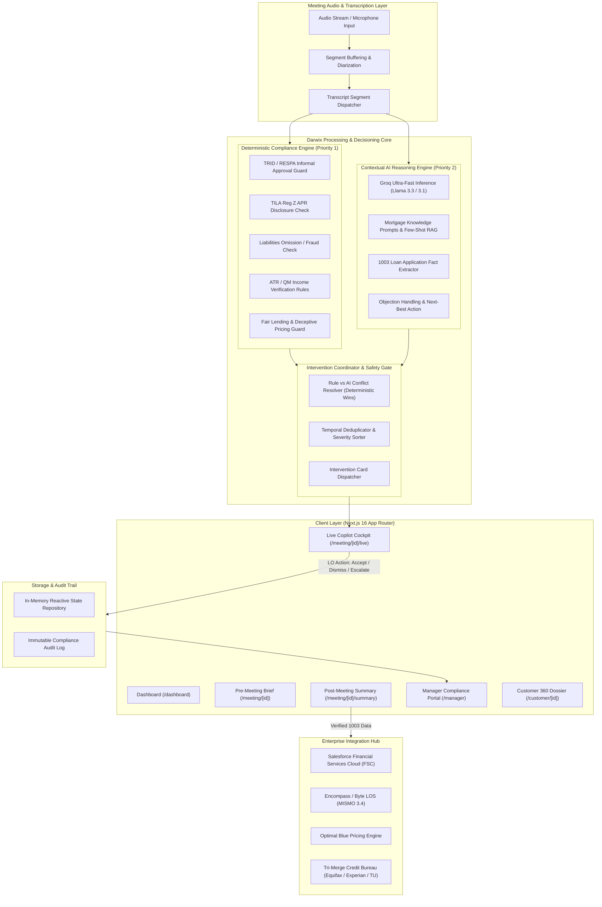
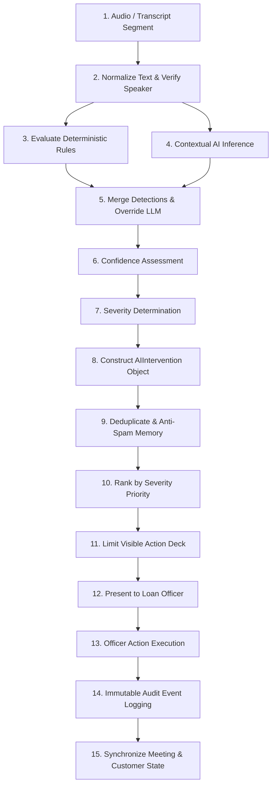

# Darwix AI — Architecture Specification
## AI Copilot for U.S. Mortgage Sales

---

## 1. Product Objective

**Darwix AI** is an enterprise-grade real-time AI copilot engineered specifically for U.S. Mortgage Loan Officers (MLOs) and financial institutions. In high-stakes mortgage originations, loan officers face intense cognitive load: engaging borrowers with empathy, collecting granular financial data for Uniform Residential Loan Applications (Fannie Mae Form 1003), identifying loan product fit, and strictly adhering to federal lending regulations (TRID, TILA, RESPA, ECOA/Fair Lending, Dodd-Frank Ability-to-Repay / Qualified Mortgage).

### Core Goals:
1. **Elevate Sales Velocity & Conversion**: Provide contextual next-best questions, product differentiators, objection-handling scripts, and real-time competitor comparison guidance.
2. **Automate Structured Fact Extraction**: Automatically map verbal conversation cues directly into structured 1003 borrower fields (employment, assets, liabilities, loan objectives).
3. **Zero-Defect Regulatory Compliance**: Deploy real-time deterministic guardrails that prevent informal approval commitments, deceptive rate quotes without APR, liability omission counseling, or unverifiable income inclusion before regulatory infractions occur.
4. **Loan Officer Empowerment (Human-in-the-Loop)**: Keep the human Loan Officer in full control with explicit action loops (`Accept`, `Dismiss`, `Ask Question`, `View Evidence`, `Escalate`).
5. **Manager & Operational Transparency**: Deliver instant post-meeting audit trails, automated CRM/LOS synchronization, and executive risk visibility.

---

## 2. System Architecture Diagram



---

## 3. Frontend Architecture

The frontend is constructed with **Next.js 16 (App Router)**, **TypeScript**, and **Tailwind CSS 4**, adhering strictly to modern enterprise SaaS interaction patterns:

### Interaction Principles:
- **Zero-Latency Feel**: Sub-second visual updates for streaming transcripts and generated interventions.
- **High Information Density with Visual Restraint**: Minimalist slate/neutral enterprise palette with purposeful semantic colors for compliance severity (`info` = sky, `low` = slate, `medium` = amber, `high` = orange, `critical` = rose).
- **No Distracting AI Gimmicks**: Elimination of glowing gradients, bouncing particles, or deceptive "typing" spinners. Interventions appear cleanly as structured decision cards.

### Live Meeting Cockpit Layout (3-Column Split):
1. **Left Column (30% width) — Conversation Stream**:
   - Audio visualizer and active speaker diarization indicators (`Loan Officer` vs `Borrower 1` vs `Borrower 2`).
   - Real-time auto-scrolling transcript with highlighted compliance trigger spans.
   - Manual phrase search and timestamped audio replay markers.
2. **Center Column (40% width) — Customer & Meeting Context**:
   - Borrower snapshot (John & Sarah Miller) with pre-populated employment, credit tier, and goals.
   - Live 1003 Fact Ledger: real-time checkmarks as facts are confirmed (income, liabilities, down payment).
   - Real-time Loan Scenario calculator (Purchase Price, Down Payment, LTV, DTI estimation).
3. **Right Column (30% width) — Darwix AI Copilot Action Deck**:
   - Stacked actionable intervention cards categorized by urgency and topic.
   - Action buttons per card:
     - `Accept`: Accepts recommended action/fact, committing it to the verified meeting state.
     - `Dismiss`: Removes card with required dismissal rationale for compliance audit logging.
     - `Ask Question`: Copies curated question to clipboard or inserts into meeting prompt queue.
     - `View Evidence`: Highlights exact transcript line and regulatory rule citation.
     - `Escalate`: Instantly alerts branch manager or secondary marketing compliance officer.

---

## 4. Backend & Service Layer Architecture

The backend leverages Next.js Server Components and Route Handlers under `/app/api/` backed by a decoupled service architecture in `/lib/`:

```
/lib
  ├── ai/              # LLM inference, Groq client, prompt templates, structured output parser
  ├── compliance/      # Pure deterministic rules, regulatory pattern matchers, severity tags
  ├── interventions/   # Arbiter, deduplication, prioritization, action handlers
  ├── meeting/         # Meeting state manager, transcript segmentation, fact extraction pipeline
  ├── integrations/    # Enterprise adapters (Salesforce FSC, Encompass, Optimal Blue, Credit)
  ├── data/            # Mock enterprise database, seed profiles (Miller family), audit logs
  ├── validation/      # Zod validation schemas for all domain entities
  └── utils/           # Formatting (currency, dates, basis points, DTI) and styling helpers
```

### Deterministic Priority Guarantee:
Every transcript chunk is evaluated **first** by pure TypeScript regex/state-machine deterministic rules in `lib/compliance/engine.ts`. If a deterministic rule triggers a compliance hazard:
1. It is assigned an immutable `source: 'RULE'` or `'HYBRID'` flag.
2. It bypasses LLM latency (<10ms) and is surfaced immediately to the Loan Officer.
3. If an LLM response contradicts a deterministic rule, the Intervention Coordinator **suppresses** the generative output and enforces the rule.
4. Generative AI output is strictly clamped to at most `HIGH` severity. Only verified deterministic rules can produce `CRITICAL` compliance interventions.

---

## 5. AI Architecture & 15-Stage Intervention Pipeline

The Darwix AI copilot executes an end-to-end 15-stage modular processing pipeline:



### Confidence Model & Filtering:
- **Numerical Score**: Evaluated on a `0.00` to `1.00` continuous scale.
- **Categorical Bands**:
  - `HIGH`: Score $\ge 0.85$ (High confidence, primary action cards).
  - `MEDIUM`: $0.60 \le$ Score $< 0.85$ (Medium confidence, secondary advisory nudges).
  - `LOW`: Score $< 0.60$ (Suppressed from Copilot Action Deck to eliminate noise).
- **Rule Exemption**: Deterministic compliance rules operate with absolute authority and are **never** filtered by confidence score.

### Graceful Fallback & Availability:
- Server-side Groq LPU calls enforce a strict **4-second timeout**.
- If the endpoint times out, returns malformed JSON, or `GROQ_API_KEY` is not present, the system instantly switches to `runContextualHeuristicInference`.
- The live workspace presents a clear, transparent status banner:
  > **Notice:** *AI reasoning temporarily unavailable. Rule-based assistance remains active.*
- Zero interruption to the loan officer; all 8 deterministic guardrails remain fully active.

---

## 6. Regulatory & Compliance Architecture

The system encodes key U.S. mortgage statutes and secondary marketing guidelines into 8 deterministic rules and 2 contextual advisory engines:

| Rule ID | Regulatory Authority | Hazard Condition | Severity | System Action & Required Intervention |
| :--- | :--- | :--- | :--- | :--- |
| **COMP-TRID-001** | **TRID / RESPA** (12 CFR § 1026.19) | Stating or implying loan approval prior to underwriting sign-off. | `HIGH` | Disclaim preliminary nature; state that formal approval requires underwriting review. |
| **COMP-TILA-002** | **TILA Reg Z** (12 CFR § 1026.24) | Quoting interest rate without Annual Percentage Rate (APR) and terms. | `MEDIUM` | Disclose APR and emphasize that rates fluctuate until locked. |
| **COMP-FRAUD-003** | **Fannie Mae B3-6-01 / 18 U.S.C. § 1014** | Suggesting exclusion or omission of an existing debt liability. | `CRITICAL` | Immediate lock notice; mandatory supervisor escalation; require 1003 disclosure. |
| **COMP-ATR-004** | **CFPB ATR / QM** (12 CFR § 1026.43) | Mentioning undocumented cash or unverifiable side contracts. | `HIGH` | Separate Stated vs Verified income; generate 2-year Schedule C document task. |
| **COMP-UDAAP-005** | **FTC Act § 5 / CFPB UDAAP** | Unsupported promise to beat any competitor rate without written quote. | `HIGH` | Request competing Loan Estimate; compare terms factually without guarantees. |
| **COMP-CONF-006** | **Fannie Mae 1003 ATR** | Conflicting liabilities stated across co-borrowers ($500 vs $1,200). | `HIGH` | Flag debt as `conflicted`; prompt officer to confirm exact figure without guessing. |
| **COMP-PROF-007** | **Standard Form 1003 Protocol** | Missing inquiry into other recurring monthly financial obligations. | `MEDIUM` | Prompt officer to confirm recurring debt before finalizing liabilities review. |
| **COMP-CLOSE-008** | **Application Governance** | Closing consultation without confirmed next action or appointment. | `MEDIUM` | Prompt next step confirmation; generate draft follow-up checklist task. |
| **AI-PROD-009** | **CFPB Anti-Steering** | Borrower asks to compare 30-year vs 15-year fixed loan terms. | `LOW` | Surface objective financial trade-offs (payment size vs lifetime interest savings). |
| **AI-OBJ-010** | **Fair Sales Practice** | Borrower claims competitor can close in 14 days. | `MEDIUM` | Address turnaround realistically; explain underwriting milestones without disparagement. |

---

## 7. Intervention Lifecycle

Every intervention follows an explicit state machine:

```
[Trigger Detected]
       │
       ▼
[Classification & Severity Ranking] (info, low, medium, high, critical)
       │
       ▼
[Active in Cockpit] ────► [Dismissed] ──► Audit Log (Reason required)
       │
       ├──► [Accepted] ────► Update 1003 Ledger / Sync Queue
       │
       ├──► [Question Asked] ──► Highlighted in Transcript
       │
       └──► [Escalated] ──► Manager Webhook / Compliance Queue
```

---

## 8. Enterprise Integration Strategy

Darwix AI is engineered to integrate seamlessly into a modern lender's technology ecosystem:

1. **Loan Origination System (LOS)**:
   - Target: Encompass (ICE Mortgage Technology) & Byte Software.
   - Interface: MISMO 3.4 XML and JSON API adapters for 1003 bidirectional synchronization.
2. **Customer Relationship Management (CRM)**:
   - Target: Salesforce Financial Services Cloud (FSC) & Total Expert.
   - Interface: Real-time event webhooks pushing meeting notes, borrower sentiment, and scheduled follow-ups.
3. **Product & Pricing Engine (PPE)**:
   - Target: Optimal Blue & Polly.
   - Interface: Real-time rate query using LTV, credit score, property type, and loan amount to populate verified scenario quotes.
4. **Credit Reporting Agency (CRA)**:
   - Target: Equifax, Experian, TransUnion tri-merge soft pull services.

---

## 9. Voice Layer Architecture & Audio Pipeline (Phase 4)

Darwix AI integrates an optional, agent-controlled voice copilot powered by **ElevenLabs Text-to-Speech (TTS)**:

```
Browser (Loan Officer Cockpit)
   ↓ [1. Clicks 'Play Response' / 'Play Question' - strictly opt-in]
Next.js Server Route (POST /api/voice/speak)
   ↓ [2. Validates input <=1,000 chars, strips metadata/markdown, verifies context]
ElevenLabs API (Stream endpoint, eleven_turbo_v2_5, voice: Rachel)
   ↓ [3. Authenticated via ELEVENLABS_API_KEY on server only]
Audio Stream (audio/mpeg chunked stream)
   ↓ [4. Streamed back to client without temporary file storage]
Browser Playback (CopilotVoicePlayer with local blob cache & Web Speech fallback)
```

### Key Architectural Tenets:
1. **API Key Isolation**: `ELEVENLABS_API_KEY` is strictly confined to the server runtime. It is never exposed in JavaScript bundles, client code, URLs, or local storage.
2. **Streaming Efficiency**: Audio is generated via `@elevenlabs/elevenlabs-js` streaming (`client.textToSpeech.stream`) and piped directly as `audio/mpeg` to the browser, minimizing latency without persistent file storage.
3. **Bounded Memory Cache**: The client caches generated audio blobs by normalized text key (max 20 entries), eliminating redundant API calls and credit consumption when replaying suggestions.
4. **Resilient Fallback Hierarchy**:
   - Level 1: ElevenLabs Turbo v2.5 streaming TTS.
   - Level 2: Native Browser SpeechSynthesis fallback (if ElevenLabs is unconfigured, offline, or rate-limited).
   - Level 3: Non-blocking Text-Only mode with explicit status notification (*"Voice assistance is temporarily unavailable. You can still use the text suggestion."*).
5. **Strict Agent Control**: AI voice never auto-speaks to the borrower and never interrupts ongoing dialogues. Playback is strictly initiated by explicit loan officer clicks.

---

## 10. Security & Governance Model

- **Environment Secrets**: `GROQ_API_KEY` and `ELEVENLABS_API_KEY` are stored strictly in server-side runtime environments and never leaked to client bundles.
- **NPI / PII Sanitization**: Bank account numbers, Social Security Numbers, and dates of birth are masked (`***-**-1234`) before passing to AI contextual prompts.
- **Audit Immutability**: All decisions, whether an AI recommendation was accepted or rejected by an agent, are stamped with user ID, UTC timestamp, confidence score, and rationale.

---

## 11. Mocked vs. Real Components Matrix

| Component | Assessment Prototype State | Production Roadmap State |
| :--- | :--- | :--- |
| **Voice Assistance (TTS)** | **Real**: ElevenLabs SDK (`@elevenlabs/elevenlabs-js`) streaming TTS (`eleven_turbo_v2_5`) with browser fallback | Real: Enterprise private voice models & agent voice cloning |
| **LLM Inference** | **Real**: Groq SDK (`llama-3.3-70b-versatile` / `llama-3.1-8b-instant`) with deterministic fallback | Real: Hybrid Groq (fast nudges) + Private Cloud Mistral/Llama for sensitive NPI |
| **Deterministic Rules** | **Real**: Full pattern-matching rule engine with TRID/TILA/RESPA/QM rules | Real: Centralized rule repository managed by Lender Compliance Office |
| **Audio Pipeline** | **Mocked / Simulated Stream**: Scripted multi-party dialogues with interactive playback & manual input | Real: WebRTC / WebSocket audio ingest with Deepgram Nova-2 / LiveKit |
| **Persistence** | **Real In-Memory Store**: Reactive thread-safe store with pre-seeded realistic borrowers | Real: PostgreSQL with Row-Level Security + Redis for session state |
| **Enterprise Sync** | **Mocked**: Standardized adapter interfaces with full payload inspection and event emitting | Real: REST/SOAP MISMO 3.4 connectors with OAuth2 mutual TLS |
| **Audit Ledger** | **Real**: In-memory append-only audit trail with export capability | Real: WORM (Write Once Read Many) compliant AWS S3 / Datadog audit sink |

---

## 12. Future Production Roadmap
1. **Real-Time WebRTC Audio**: Low-latency bi-directional streaming via LiveKit/SIP trunking into branch telephony (Zoom Phone, Cisco Jabber, RingCentral).
2. **Guideline RAG with Vector Database**: Ingestion of Fannie Mae Single Family Selling Guide, Freddie Mac Single-Family Seller/Servicer Guide, and lender-specific investor overlays using pgvector / Pinecone.
3. **Automated AUS Simulation**: Pre-flight Fannie Mae Desktop Underwriter (DU) / Freddie Mac Loan Product Advisor (LPA) simulation during the call.
