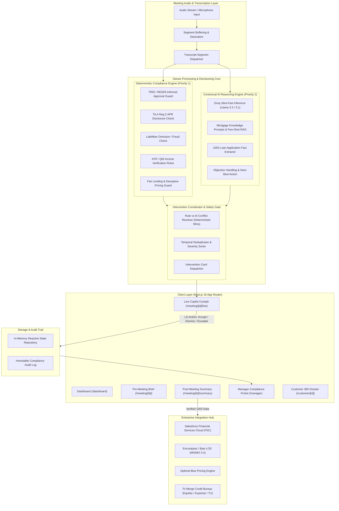
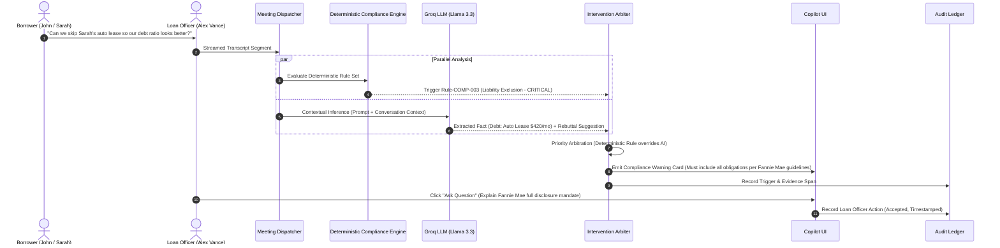

# Darwix AI — Architecture Specification
## AI Copilot for U.S. Mortgage Sales

---

## 1. Product Objective

**Darwix AI** is an enterprise-grade real-time AI copilot engineered specifically for U.S. Mortgage Loan Officers (MLOs) and financial institutions. In high-stakes mortgage originations, loan officers face intense cognitive load: engaging borrowers with empathy, collecting granular financial data for Uniform Residential Loan Applications (Fannie Mae Form 1003), identifying loan product fit, and strictly adhering to federal lending regulations (TRID, TILA, RESPA, ECOA/Fair Lending, Dodd-Frank Ability-to-Repay / Qualified Mortgage).

### Core Goals:
1. **Elevate Sales Velocity & Conversion**: Provide contextual next-best questions, product differentiators, objection-handling scripts, and real-time competitor comparison guidance.
2. **Automate Structured Fact Extraction**: Automatically map verbal conversation cues directly into structured 1003 borrower fields (employment, assets, liabilities, loan objectives).
3. **Zero-Defect Regulatory Compliance**: Deploy real-time deterministic guardrails that prevent informal approval commitments, deceptive rate quotes without APR, liability omission counseling, or unverifiable income inclusion before regulatory infractions occur.
4. **Loan Officer Empowerment (Human-in-the-Loop)**: Keep the human Loan Officer in full control with explicit action loops (`Accept`, `Dismiss`, `Ask Question`, `View Evidence`, `Escalate`).
5. **Manager & Operational Transparency**: Deliver instant post-meeting audit trails, automated CRM/LOS synchronization, and executive risk visibility.

---

## 2. System Architecture Diagram



---

## 3. Frontend Architecture

The frontend is constructed with **Next.js 16 (App Router)**, **TypeScript**, and **Tailwind CSS 4**, adhering strictly to modern enterprise SaaS interaction patterns:

### Interaction Principles:
- **Zero-Latency Feel**: Sub-second visual updates for streaming transcripts and generated interventions.
- **High Information Density with Visual Restraint**: Minimalist slate/neutral enterprise palette with purposeful semantic colors for compliance severity (`info` = sky, `low` = slate, `medium` = amber, `high` = orange, `critical` = rose).
- **No Distracting AI Gimmicks**: Elimination of glowing gradients, bouncing particles, or deceptive "typing" spinners. Interventions appear cleanly as structured decision cards.

### Live Meeting Cockpit Layout (3-Column Split):
1. **Left Column (30% width) — Conversation Stream**:
   - Audio visualizer and active speaker diarization indicators (`Loan Officer` vs `Borrower 1` vs `Borrower 2`).
   - Real-time auto-scrolling transcript with highlighted compliance trigger spans.
   - Manual phrase search and timestamped audio replay markers.
2. **Center Column (40% width) — Customer & Meeting Context**:
   - Borrower snapshot (John & Sarah Miller) with pre-populated employment, credit tier, and goals.
   - Live 1003 Fact Ledger: real-time checkmarks as facts are confirmed (income, liabilities, down payment).
   - Real-time Loan Scenario calculator (Purchase Price, Down Payment, LTV, DTI estimation).
3. **Right Column (30% width) — Darwix AI Copilot Action Deck**:
   - Stacked actionable intervention cards categorized by urgency and topic.
   - Action buttons per card:
     - `Accept`: Accepts recommended action/fact, committing it to the verified meeting state.
     - `Dismiss`: Removes card with required dismissal rationale for compliance audit logging.
     - `Ask Question`: Copies curated question to clipboard or inserts into meeting prompt queue.
     - `View Evidence`: Highlights exact transcript line and regulatory rule citation.
     - `Escalate`: Instantly alerts branch manager or secondary marketing compliance officer.

---

## 4. Backend & Service Layer Architecture

The backend leverages Next.js Server Components and Route Handlers under `/app/api/` backed by a decoupled service architecture in `/lib/`:

```
/lib
  ├── ai/              # LLM inference, Groq client, prompt templates, structured output parser
  ├── compliance/      # Pure deterministic rules, regulatory pattern matchers, severity tags
  ├── interventions/   # Arbiter, deduplication, prioritization, action handlers
  ├── meeting/         # Meeting state manager, transcript segmentation, fact extraction pipeline
  ├── integrations/    # Enterprise adapters (Salesforce FSC, Encompass, Optimal Blue, Credit)
  ├── data/            # Mock enterprise database, seed profiles (Miller family), audit logs
  ├── validation/      # Zod validation schemas for all domain entities
  └── utils/           # Formatting (currency, dates, basis points, DTI) and styling helpers
```

### Deterministic Priority Guarantee:
Every transcript chunk is evaluated **first** (or concurrently) by pure TypeScript regex/state-machine deterministic rules in `lib/compliance/engine.ts`. If a deterministic rule triggers a high or critical compliance hazard:
1. It is assigned an immutable `source: 'deterministic_rule'` flag.
2. It bypasses LLM latency and is surfaced immediately to the Loan Officer.
3. If an LLM response contradicts a deterministic rule (e.g., LLM suggests "Tell the borrower their rate is locked at 5.75%"), the Arbiter **suppresses** the generative output and logs the anomaly.

---

## 5. AI Architecture & Boundaries



### Strict Non-Negotiable Boundaries:
- **No Autonomous Execution**: The AI cannot lock loans, approve applications, alter liability records in the LOS, or transmit disclosures without human-in-the-loop sign-off.
- **Strict Structured Outputs**: All LLM queries enforce JSON output validated against Zod schemas. Hallucinated keys or malformed structures are rejected at the parsing boundary.
- **Fail-Safe Fallbacks**: If the Groq API key is absent or the endpoint times out, the system operates uninterrupted using local deterministic rule engines and pre-compiled mortgage playbooks.

---

## 6. Regulatory & Compliance Architecture

The system encodes key U.S. mortgage statutes into deterministic verification rules:

| Rule ID | Regulatory Authority | Hazard Condition | System Response & Required Action |
| :--- | :--- | :--- | :--- |
| **COMP-001** | **TRID / RESPA** (12 CFR § 1026.19) | Verbal statement committing approval (e.g., *"You're definitely approved"*) prior to Underwriter sign-off. | **CRITICAL WARNING**: Prohibit informal approval; prompt LO to state conditional pre-qualification status only. |
| **COMP-002** | **TILA Reg Z** (12 CFR § 1026.24) | Stating a specific interest rate without stating the Annual Percentage Rate (APR) and payment terms. | **HIGH WARNING**: Require immediate APR disclosure and note that rate is floating until formal lock agreement. |
| **COMP-003** | **Fannie Mae Selling Guide / Fraud** | Borrower or LO suggesting omitting debts, loans, or hidden obligations from Form 1003. | **CRITICAL WARNING**: Mandatory notification that all debts must be reported; fraud risk citation under 18 U.S.C. § 1014. |
| **COMP-004** | **Dodd-Frank ATR / QM** | Discussion of factoring undocumented cash, side jobs, or future bonuses without 2-year history. | **HIGH WARNING**: Clarify W-2 / tax return documentation requirements for qualifying income. |
| **COMP-005** | **FTC / CFPB UDAAP** | Blind guarantee to "beat any competitor by 0.5%" without written competitor Loan Estimate in hand. | **MEDIUM WARNING**: Prohibit deceptive commitments; prompt request for competing Loan Estimate document. |
| **COMP-006** | **ECOA / Fair Lending (Reg B)** | Inconsistent treatment between primary borrower and co-borrower financial obligations. | **HIGH ALERT**: Enforce joint asset and credit evaluation parity. |

---

## 7. Intervention Lifecycle

Every intervention follows an explicit state machine:

```
[Trigger Detected]
       │
       ▼
[Classification & Severity Ranking] (info, low, medium, high, critical)
       │
       ▼
[Active in Cockpit] ────► [Dismissed] ──► Audit Log (Reason required)
       │
       ├──► [Accepted] ────► Update 1003 Ledger / Sync Queue
       │
       ├──► [Question Asked] ──► Highlighted in Transcript
       │
       └──► [Escalated] ──► Manager Webhook / Compliance Queue
```

---

## 8. Enterprise Integration Strategy

Darwix AI is engineered to integrate seamlessly into a modern lender's technology ecosystem:

1. **Loan Origination System (LOS)**:
   - Target: Encompass (ICE Mortgage Technology) & Byte Software.
   - Interface: MISMO 3.4 XML and JSON API adapters for 1003 bidirectional synchronization.
2. **Customer Relationship Management (CRM)**:
   - Target: Salesforce Financial Services Cloud (FSC) & Total Expert.
   - Interface: Real-time event webhooks pushing meeting notes, borrower sentiment, and scheduled follow-ups.
3. **Product & Pricing Engine (PPE)**:
   - Target: Optimal Blue & Polly.
   - Interface: Real-time rate query using LTV, credit score, property type, and loan amount to populate verified scenario quotes.
4. **Credit Reporting Agency (CRA)**:
   - Target: Equifax, Experian, TransUnion tri-merge soft pull services.

---

## 9. Security & Governance Model

- **Environment Secrets**: `GROQ_API_KEY` and `ELEVENLABS_API_KEY` are stored strictly in server-side runtime environments and never leaked to client bundles.
- **NPI / PII Sanitization**: Bank account numbers, Social Security Numbers, and dates of birth are masked (`***-**-1234`) before passing to AI contextual prompts.
- **Audit Immutability**: All decisions, whether an AI recommendation was accepted or rejected by an agent, are stamped with user ID, UTC timestamp, confidence score, and rationale.

---

## 10. Mocked vs. Real Components Matrix

| Component | Assessment Prototype State | Production Roadmap State |
| :--- | :--- | :--- |
| **LLM Inference** | **Real**: Groq SDK (`llama-3.3-70b-versatile` / `llama-3.1-8b-instant`) with deterministic fallback | Real: Hybrid Groq (fast nudges) + Private Cloud Mistral/Llama for sensitive NPI |
| **Deterministic Rules** | **Real**: Full pattern-matching rule engine with TRID/TILA/RESPA/QM rules | Real: Centralized rule repository managed by Lender Compliance Office |
| **Audio Pipeline** | **Mocked / Simulated Stream**: Scripted multi-party dialogues with interactive playback & manual input | Real: WebRTC / WebSocket audio ingest with Deepgram Nova-2 / LiveKit |
| **Persistence** | **Real In-Memory Store**: Reactive thread-safe store with pre-seeded realistic borrowers | Real: PostgreSQL with Row-Level Security + Redis for session state |
| **Enterprise Sync** | **Mocked**: Standardized adapter interfaces with full payload inspection and event emitting | Real: REST/SOAP MISMO 3.4 connectors with OAuth2 mutual TLS |
| **Audit Ledger** | **Real**: In-memory append-only audit trail with export capability | Real: WORM (Write Once Read Many) compliant AWS S3 / Datadog audit sink |

---

## 11. Future Production Roadmap
1. **Real-Time WebRTC Audio**: Low-latency bi-directional streaming via LiveKit/SIP trunking into branch telephony (Zoom Phone, Cisco Jabber, RingCentral).
2. **Guideline RAG with Vector Database**: Ingestion of Fannie Mae Single Family Selling Guide, Freddie Mac Single-Family Seller/Servicer Guide, and lender-specific investor overlays using pgvector / Pinecone.
3. **Automated AUS Simulation**: Pre-flight Fannie Mae Desktop Underwriter (DU) / Freddie Mac Loan Product Advisor (LPA) simulation during the call.
