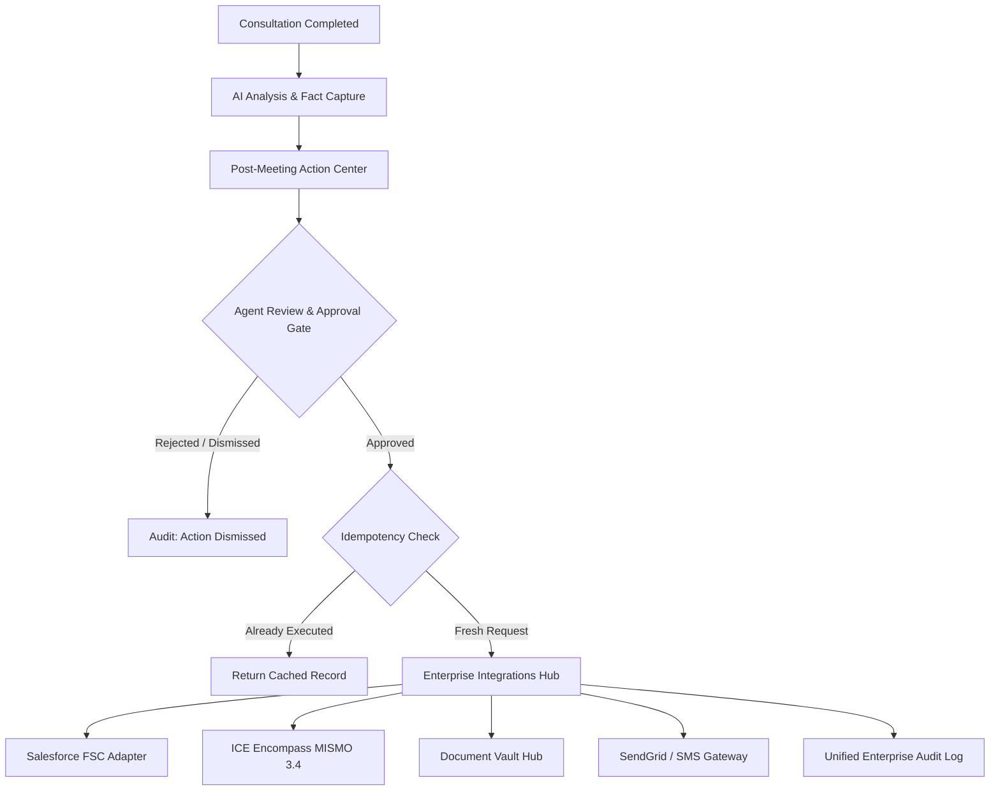

# Darwix AI — Enterprise Integrations & Workflow Architecture

## 1. Architectural Overview

Darwix AI employs an **Adapter-Based Enterprise Integration Architecture** designed to seamlessly bridge real-time sales consultations with downstream lending platforms. In mortgage origination, AI recommendations must never autonomously alter core financial records or commit an enterprise to legal obligations.



Every integration adheres to a strict interface contract so mocked adapters can be replaced by live production gateways without altering UI components or business rules.

---

## 2. Integration Status Model & Classification

Each enterprise integration endpoint has an explicit, visible status level:

| System | Adapter / Vendor | Status | Description |
|---|---|---|---|
| **CRM** | Salesforce Financial Services Cloud | `MOCKED` | Simulated enterprise REST API managing Leads, Activities, and Follow-Up Tasks. |
| **LOS** | ICE Encompass (MISMO 3.4) | `MOCKED` | Form 1003 loan application schema with strict STATED vs VERIFIED financial distinction. |
| **Documents** | Blend / Roostify Document Gateway | `MOCKED` | Profile-aware verification checklist and secure borrower portal link generation. |
| **Communications** | Twilio SendGrid / SMS Relay | `MOCKED` | Outbound email & SMS gateway with mandatory loan officer approval gate. |
| **PPE** | Optimal Blue | `FUTURE` | Live secondary marketing rate lock and investor pricing engine. |
| **AUS** | Fannie Mae DU / Freddie Mac LPA | `FUTURE` | Automated Underwriting System for instant Approve/Eligible recommendation. |
| **Credit Bureau** | CoreLogic Tri-Merge Gateway | `FUTURE` | Automated tri-merge credit report pull and soft inquiry engine. |
| **Title & Escrow** | First American Title Gateway | `FUTURE` | Automated closing fee calculation and title search ordering. |

> [!NOTE]
> All mocked adapters clearly display: **"Demo environment — simulated enterprise integration"**. The system never misrepresents simulated adapters as live production feeds.

---

## 3. Subsystem Specifications

### 3.1. Salesforce Financial Services Cloud (CRM)
- **Adapter**: [`lib/integrations/crm/mock-crm.ts`](file:///Users/roushan_iiitbgp/Desktop/Mortgage-ai-copilot/lib/integrations/crm/mock-crm.ts)
- **Key Capabilities**:
  - Customer Lead lookup and auto-provisioning (`CRM-LEAD-10482`).
  - Consultation meeting activity logging (`CRM-ACT-20891`).
  - Automated follow-up task creation with priority and due dates (`CRM-TASK-30912`).
  - Lead stage progression to `Qualified / Needs Documentation`.
  - Storing next action recommendations (`Collect income and liability documents`).

### 3.2. ICE Encompass (LOS — Loan Origination System)
- **Adapter**: [`lib/integrations/los/mock-los.ts`](file:///Users/roushan_iiitbgp/Desktop/Mortgage-ai-copilot/lib/integrations/los/mock-los.ts)
- **Data Standard**: MISMO 3.4 XML/JSON schema.
- **Stage Defense**:
  - Consultation meetings can only move an application to **`Information Collection`** or **`Documentation Pending`**.
  - Under no circumstances can a consultation autonomously advance an application to `Approved` or `Underwriting`. Any attempt is automatically clamped by system rules.
- **STATED vs. VERIFIED Financial Distinction**:
  - Annual/Monthly income extracted from conversation (e.g. John's $11,250/mo base, Sarah's $3,166/mo net) is recorded with `verificationState: "STATED"` and explicitly flagged: **`STATED — NOT VERIFIED`**.
  - Liabilities (Toyota loan $480, student loan $340, BMW auto lease $590) are recorded as stated obligations. DTI is recorded as an estimate only.

### 3.3. Document Management Hub
- **Adapter**: [`lib/integrations/documents/mock-document-system.ts`](file:///Users/roushan_iiitbgp/Desktop/Mortgage-ai-copilot/lib/integrations/documents/mock-document-system.ts)
- **Profile-Aware Recommendations**:
  - W-2 Employees: 30-day pay stubs, 2-year W-2 wage statements.
  - Self-Employed: 2-year Form 1040 federal tax returns with Schedule C, Year-to-Date P&L statement, 3-month business bank statements.
  - Assets: 60-day consecutive bank and investment statements.
  - Identity: Government-issued photo ID (CIP compliance).
  - Objections: Official written competitor Loan Estimate (Rocket Mortgage).
- **Document States**:
  `NOT_REQUESTED` → `REQUESTED` → `UPLOADED` → `UNDER_REVIEW` → `VERIFIED` (or `REJECTED`, `MISSING`).
- **Language Guard**: All documentation items are presented as **"Potential documents to verify"** rather than definitive underwriting requirements.

### 3.4. Communication Gateway
- **Adapter**: [`lib/integrations/communications/mock-communication.ts`](file:///Users/roushan_iiitbgp/Desktop/Mortgage-ai-copilot/lib/integrations/communications/mock-communication.ts)
- **Human-in-the-Loop Constraint**: External borrower communication cannot be transmitted without explicit loan officer approval. The adapter throws an exception if dispatch is attempted without an approved officer ID.

---

## 4. Approval Gates & Idempotency

### Approval Gate Architecture
The copilot adheres to the strict principle: **AI recommends, humans decide, systems execute**.

```
AI Recommendation ──> Loan Officer Review ──> Approval Gate ──> System Action ──> Audit Event
```

Any attempt to trigger `syncCRM`, `syncLOS`, `requestDocuments`, or `sendCommunication` without `isApproved: true` results in an immediate `403 Forbidden` response.

### Duplicate Protection & Idempotency
Enterprise integrations must prevent duplicate record creation. The hub maintains deterministic idempotency keys:
- CRM Sync: `${meetingId}:crm_sync`
- LOS Sync: `${meetingId}:los_sync`
- Document Request: `${meetingId}:doc_request`

Subsequent requests return cached results with `isIdempotentReplay: true` and display `"Already synced"` in the user interface rather than generating duplicate lead records, tasks, or conditions.

---

## 5. Failure Handling & Resiliency

Integration states follow the standard lifecycle:
`SUCCESS` | `PENDING` | `FAILED` | `RETRYABLE`

- Adapters gracefully catch HTTP timeouts, network drops, and provider rate limits (e.g. 503 Service Unavailable, 504 Gateway Timeout).
- Failures are recorded in the audit trail without exposing secrets or stack traces.
- The UI exposes a **"Retry"** action that allows safe re-invocation once network conditions stabilize.
- The Integration Center ([`/settings/integrations`](file:///Users/roushan_iiitbgp/Desktop/Mortgage-ai-copilot/app/settings/integrations/page.tsx)) includes QA simulation switches to test failure handling in a sandbox environment.

---

## 6. Unified Enterprise Audit Trail

Every state change produces an immutable audit event conforming to enterprise lending compliance:

```typescript
export interface AuditEvent {
  id: string;
  timestamp: string;
  actor: { userId: string; role: string };
  actorType?: 'loan_officer' | 'system' | 'underwriter' | 'borrower' | 'manager';
  action?: string;
  entityType?: 'meeting' | 'customer' | 'lead' | 'loan_application' | 'document' | 'task';
  entityId?: string;
  source?: string;
  status?: string;
  details: Record<string, unknown>;
  metadata?: Record<string, unknown>;
}
```

Audit trails are visible across the Meeting Summary, Operations Command Center, and Manager Portal.

---

## 7. Production Integration Roadmap

When replacing mocked adapters with production enterprise APIs:
1. **Salesforce FSC**: Implement OAuth 2.0 Web Server Flow and Salesforce Bulk API v2.
2. **ICE Encompass**: Use Encompass Developer Connect REST API v3 with mTLS mutual authentication.
3. **Blend / PointServ**: Webhook-based document ingestion and automated OCR condition fulfillment.
4. **Twilio / SendGrid**: Provision verified domain senders with SPF, DKIM, and TCPA consent verification.
